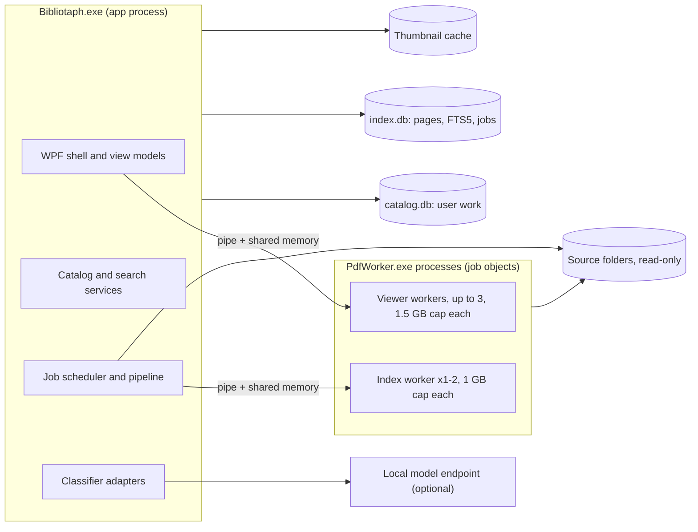

# Bibliotaph architecture

Version 1.0 · agreed by Dave on 8 October 2026 · companion to [product-spec.md](product-spec.md) (v0.3)

One WPF app on .NET 11, PDFium in a small pool of isolated worker processes, two SQLite files (user work in one, a rebuildable index in the other) with FTS5 search, and an in-process durable job queue.

The discussion copy, with comments, is the private [architecture proposal doc](https://claude.ai/code/artifact/c274b66e-807d-487b-af28-4707e03da9d0). This file is the version of record; change it by pull request.

## Decisions

| # | Area | Decision | Why | Alternative if it fails |
| --- | --- | --- | --- | --- |
| 1 | Target framework | .NET 11 (GA November 2026), self-contained; move to .NET 12 LTS in early 2028 | Standard-term releases get 24 months, so .NET 11 and .NET 10 LTS both reach end of support in November 2028 ([Microsoft](https://devblogs.microsoft.com/dotnet/dotnet-sts-releases-supported-for-24-months/)). The spike already runs on 11. | .NET 10 LTS |
| 2 | Process model | One UI process plus a pool of PDFium workers: one dedicated to the viewer, one or two for indexing, each in its own job object | A slow or hostile file being indexed can never stall the page being read | One shared worker |
| 3 | Storage | SQLite, two files: `catalog.db` (user work, migrated, backed up) and `index.db` (derived; upgraded in place when a schema change only adds, otherwise rebuilt), joined with ATTACH | Makes "rebuild never touches user work" (spec §10) a physical guarantee | One database with careful table ownership |
| 4 | Data access | EF Core for `catalog.db`; Microsoft.Data.Sqlite with parameterized SQL (Dapper for reads, reused prepared commands for bulk inserts) for `index.db` and search | FTS5's `MATCH`, `bm25()`, `snippet()` and `highlight()` have no LINQ translation, bulk page inserts need prepared commands in batched transactions, and `index.db` has no migrations. Values are always bound; the `MATCH` string is generated from the parsed query with every term quoted, and column names come from a fixed whitelist, since parameters cover neither. | Dapper everywhere, with hand-rolled migrations |
| 5 | Search engine | SQLite FTS5 (bm25, unicode61 tokenizer, diacritics removed); vectors for Release B later in the same index | Inside the 1-second p95 target for the collection; no second storage engine | Lucene.NET 4.8 |
| 6 | OCR | Windows.Media.Ocr behind `IOcrEngine`, running inside the index worker | Ships with Windows; no native binaries or language data to package | Tesseract 5, which lost the slice 1 bake-off: on 20 pages each of two scanned books Windows OCR scored 81% known words to Tesseract's 73 to 81%, recovered 99% of a digital book's words to 93 to 96%, and took about 250 ms a page to Tesseract's 1.6 to 3.5 s |
| 7 | Job queue | In-process, durable table in `index.db`, run by hosted services | Processing runs only while the app is open; a small scheduler is easier to reason about than a framework | A library queue if the scheduler outgrows that |
| 8 | UI toolkit | WPF with CommunityToolkit.Mvvm and Microsoft.Extensions.Hosting for DI; custom theme from the mockup tokens; no third-party control suite | The mockup is a bespoke editorial look, not Fluent | WPF-UI or the built-in Fluent theme as a base |
| 9 | AI adapter | Local first: an OpenAI-compatible endpoint (Ollama, LM Studio) behind `IClassifier`; endpoint and model configurable | Keeps text on the machine and costs nothing per book. The risk is the 95% precision gate, so the pilot measures it before anything is auto-applied. | Cloud adapter if local precision falls short on the pilot |
| 10 | Content identity | SHA-256 over the whole file, with NTFS file IDs to spot moves without rehashing | The spike hashed a 782 MB book in 456 ms; disk reads dominate, not the algorithm | XxHash128 if hashing shows up in profiles |
| 11 | Installer and updates | Velopack: per-user install, no admin, delta updates from GitHub Releases | Works with an unpackaged WPF app and native PDFium binaries | MSIX |
| 12 | Repository | Public `munkycdev/bibliotaph` under GPL-3.0-or-later (`LICENSE`, third-party notices in `THIRD-PARTY-NOTICES.md`); `spikes/` holds each spike in its own folder (`spikes/pdf-feasibility/`), committed for reference; `docs/` holds the spec and this design | | |

## At a glance

Everything except PDFium runs in the app process. The scanner in the app reads source folders to hash them through the same read-only reader the workers use.

## Process model and isolation

| Runs in | What | Why there |
| --- | --- | --- |
| `Bibliotaph.exe` | WPF shell, view models, catalog and index access, search, job scheduler, classifier adapters, backup | One place owns the databases; no IPC for ordinary work |
| `PdfWorker.exe`, viewer workers | Open, render, tile, find-on-page, character boxes for the documents being read | One per window showing a PDF, up to three (a fourth window shares the least busy, see 4a); never shares a queue with indexing |
| `PdfWorker.exe`, index slots (1 by default, 2 on "use more resources") | Probe, per-page text, covers, OCR of flagged pages | OCR needs a rendered bitmap; keeping it next to PDFium keeps large bitmaps out of the UI process |

Each worker keeps the spike's contract: length-prefixed messages over a named pipe, pixels through a shared memory section, a job object that caps committed memory (1.5 GB for the viewer worker, 1 GB for index workers) and kills the worker if the app dies, and a per-request timeout after which the worker is killed and restarted. Additions for the real app:

- **One process per job object, no children.** `JOB_OBJECT_LIMIT_ACTIVE_PROCESS` = 1. A low-integrity token is a later hardening step.
- **Poison-file memory.** The host records which file and page killed a worker; after two kills on the same page the job fails with that reason, so one bad book cannot loop the queue (A18).
- The message format moves from JSON to a versioned binary or MessagePack format only if profiling shows JSON costs real time.

## Solution layout

| Project | Kind | Holds | References |
| --- | --- | --- | --- |
| `Bibliotaph.Core` | Class library | Domain types (Document, FileLocation, PageRef, Assertion, Collection, SessionPack, Capability), query AST, policies; no I/O | Nothing |
| `Bibliotaph.Catalog` | Class library | EF Core context for `catalog.db`, migrations, backup and restore, JSON and CSV export | Core |
| `Bibliotaph.Index` | Class library | `index.db` schema, page and FTS5 writers, search and facet queries, query parser | Core |
| `Bibliotaph.Processing` | Class library | Source scanner, file watcher, reconciliation, job queue, pipeline stages | Core, Catalog, Index, Pdf.Host |
| `Bibliotaph.Classification` | Class library | `IClassifier`, rule-based hints, prompt and schema versions, evidence validator, adapters | Core |
| `Bibliotaph.Pdf.Contracts` | Class library | Worker messages and framing (from `Spike.Contracts`) | Nothing |
| `Bibliotaph.Pdf.Host` | Class library | Worker pool, job objects, shared sections, restarts (from `Spike.WorkerHost`) | Pdf.Contracts |
| `Bibliotaph.PdfWorker` | Console exe | PDFium and OCR (from the spike's `PdfWorker`) | Pdf.Contracts |
| `Bibliotaph.Viewer` | WPF control library | Virtualized page surface, tiling, highlights, text selection, image viewer (from `ViewerPrototype`) | Core, Pdf.Host |
| `Bibliotaph.App` | WPF exe | Shell, screens, view models, theme, DI composition | Everything above except PdfWorker |

Tests live under `tests/`: unit tests for Core, Index (in-memory SQLite) and Classification; integration tests for Pdf.Host against generated fixtures; and an acceptance harness, grown from the spike's `Harness`, that drives scenarios A01 to A18 against a corpus manifest.

Build-enforced rules: Core and Pdf.Contracts reference nothing; only App knows about WPF windows; only Processing and Pdf.Host open source files, and only through one read-only `ISourceFileReader` (a banned-API analyzer rejects write-capable `FileStream` and `File.Write*` calls elsewhere). The one exception is returning an online-only file to online-only (see OneDrive below), which changes only its local download state and lives in one small Processing class.

## Storage

Everything lives in `%LOCALAPPDATA%\Bibliotaph\`, never in a synced folder. Both databases run in WAL mode.

| File | Holds | On schema change | Backed up |
| --- | --- | --- | --- |
| `catalog.db` | Source roots, file locations, documents, metadata assertions, vocabulary, ignored folder labels, classification runs, collections, smart views, session packs, notes, rejections, settings | EF Core migration, preceded by an automatic `VACUUM INTO` copy | Always |
| `index.db` | Pages (text, printed label, size, text quality, fingerprint), OCR word boxes for OCR'd pages, FTS5 tables, per-stage status, job queue, the entries the library lists (`entry_doc`), and a projection of effective metadata (`entry_meta`, `entry_facet`, `term_alias`), of which entries a model has read (`entry_ai`), and of the user's marks (`entry_scope`, `scope_name`, `entry_opened`) | An additive change runs its embedded `upgrade-N.sql` in a transaction; anything else, or a failed upgrade, drops and rebuilds, and documents re-queue from their content hash. Metadata is projected again from `catalog.db` at startup either way | Optional (spec §10) |
| `cache\` | Covers, thumbnails and page previews as WebP files named by content hash and size; `cache\extract\` holds files from inside ZIPs, named by content hash, while they are processed or viewed (least recently used go past 5 GB) | Deleted freely | Never |

Core tables (full schema in slice 0):

- `source_root`: path, volume serial, availability (online, offline, removed by user).
- `file_location`: root, relative path, size, modified time, NTFS file ID, content hash, last seen, state (present, missing, online-only), and while new content at the path waits to be hashed, the document it held before (`previous_document_id`). A ZIP is a location with a hash and no document; each PDF or image inside it is a location of its own with the ZIP as `container_id`, its name inside the ZIP (`entry_path`) and CRC (`entry_crc32`), and a relative path that reads as File Explorer shows it (`Bundle.zip\Maps\Harbor.jpg`). Its state follows the ZIP's. `problem` says why a file inside a ZIP isn't read (a ZIP inside it, a password, too big, damaged), for Files needing attention.
- `document`: one row per content version: content hash, format, page count, capabilities with reasons, protection type.
- `entry`: one row per thing the library lists, which is what the user catalogs: kind (whole, part, pack, elsewhere), parent entry, created time. Every document is shown by one whole-document entry; a book owned elsewhere (in print, on a VTT) is an entry with no sources, its metadata the user's own assertions; later steps add parts (see the "Catalog entry design" tab). An entry joined into another as a copy keeps its row, pointing at the entry it joined (`merged_into_entry_id`), so Undo can bring it back. A pack has no sources of its own: each of its images keeps its whole-document entry, with its versions, hints and anything set on it, and points at the pack as its parent, which hides it from the library until the pack is split.
- `pack_decision`: a folder (the images directly in it) or ZIP (subfolders included) whose images are one pack, were split again, or wait in Needs review as a proposal: root, path, whether it is a ZIP, the answer (packed, split, proposed) and the pack's entry, made when the folder is first packed or proposed. Kept by path, so a rescan neither packs a split folder again, asks about it twice, nor loses a pack.
- `entry_source`: which document an entry shows, optionally a PDF page range (for parts), and whether it is the entry's current source. An entry has one current source, and a document has at most one whole-document entry. An entry with several whole-document sources has copies (identical text) or versions (new content at the same path); the current one is what opens, and when its files are all gone the newest copy with a file opens instead, without changing the choice.
- `entry_join`: each time Match joined one card into another: both entries, the two documents, and the rows that moved (as JSON), so Not the same book can move them back.
- `elsewhere_match`: a file whose title matches a book owned elsewhere, with no publisher that says otherwise: a "Is this its file?" card in Needs review while it has no answer. Same book joins the file's card to the book's (recorded in `entry_join` with the file as its own match, so Undo can part them) and the book becomes a whole entry; Separate book stays, so the pair isn't asked about again.
- `copy_decision`: pairs of content hashes the user said are not the same book, so Match never joins them or proposes them again.
- `version_proposal`: a "new version?" card in Needs review: the newer file, the file of the book it looks like a new version of, and why (pages in common, or title and publisher). One per file, for its best match; it goes once answered.
- `assertion`: entry, content hash of the copy a proposal came from (none for the user's own values), field, value as JSON, origin (embedded, folder, filename, rule, AI, user), evidence pages, run ID, state (provisional, confirmed, rejected, superseded, awaiting a pending vocabulary term, or set aside from another copy's card). The effective value is a view over this table, never an overwritten column.
- `favorite`: one row per entry marked with a heart, with when. A join moves it to the card the copy joined when that card has none, and Not the same book moves it back; a removed book owned elsewhere keeps it for Undo.
- `reading_state`: one row per entry that has been opened: when, which document, and the page an ordinary open was left at (search hits and session items keep no page). Another copy opening starts at the page that matches where the last one was left, and a version made current takes the place with it (slice 4h). Joins move it as they move a heart.
- `collection`: a collection's name, optional description, Pinned flag, when it was made and last added to, and the collection it sits in (none at the top). Nested to any depth. Deleting one moves its sub-collections up a level first, and Undo puts it back with its id.
- `collection_item`: (collection, entry, when added) for each book added to a collection itself. A book in a sub-collection is in every collection above it through the tree, not through rows here. Joins move memberships as they move a heart, to every collection the surviving card isn't in already; a removed book owned elsewhere keeps them for Undo.
- `page_ref`: a page range: document (pages belong to content, not to entries), first and last PDF page, and the printed label and page fingerprint (index.db's `page.label` and `page.fingerprint`) of its first and last pages when it was made. Session pack items and page notes point here. Where a range opens in another version is worked out from these once that version has its fingerprints, and kept in `check`, `check_document_id` and the check's first and last PDF page: found, needs a look, or checked by the user (see `PagePlaces`).
- `session_pack`: a session's title, optional date, notes, when it was made and when it was last worked on (`touched_utc`). The pack touched last is the current one, which Add page and Add to session add to.
- `session_section`: a named heading in a pack (Adventure, Maps…), in order. Deleting one moves its items to the end of the section above.
- `session_item`: (pack, section or none, position, entry, page range or none, label, note, added). An item without a range is the whole book. Deleting the entry deletes its items; a join moves them to the surviving card (`MovedRows.SessionItems`), and a removed book owned elsewhere keeps them for Undo.
- `smart_view`: (name, definition, created, updated). The definition is JSON with a version, written and read by the app (`SmartViewDefinition`): the Library's search text, scope key, "only books added here", filters, order, layout and results tab. Never a list of books, so a view is the search run again.
- `note`: (entry, page range or none, text, created, updated). An entry has at most one note of its own (no range; a unique filtered index) and any number on its pages. Deleting the entry deletes its notes, and a page note's range goes with it. A join moves page notes to the surviving card, and its own note too when that card has none, otherwise appends the text after a blank line (`MovedRows.Note`, `NoteAppended`, `PageNotes`); Not the same book undoes it, stripping the appended text if it is still at the end. A removed book owned elsewhere keeps its own note for Undo.

The UI reads through separate read connections; all writes to `index.db` go through one writer task that batches pages into transactions.

Classification runs live in `catalog.db` beside the assertions they produce, so a rebuilt index never loses a model's evidence or the record of what has already been classified. `index.db` holds only what search needs from metadata (version 12 of its schema). Pages, OCR, outlines, stage status and jobs stay keyed by document; what the library lists is keyed by entry:

- `entry_doc`: (entry, document, kind, copies, name, members, added) for each entry, the document it currently shows and how many files of the book it has. Probe writes it as soon as a document is added, and the metadata projection refreshes it. A pack shows its first image, and has its folder's or ZIP's name, the title until one is set, and how many images it has. A book owned elsewhere has no document and keeps when it was added; library queries join `doc` optionally, so it lists, sorts and is found by its metadata, is always in scope whichever folders are online, and never appears in Inside documents.
- `entry_member`: a pack's images in file name order (numbers as numbers), with each image's document, own entry and file name, for the mosaic of its first four covers, its inspector grid and stepping through it in the viewer.
- `member_fts`: the file names (without extension) of the images in packs, keyed by each image's own entry, so the Documents tab finds a pack by an image's name and says which image matched.
- `entry_meta`: one row per entry with the effective title, system and type labels, publisher, series, authors, tags, level range and state (known, n/a, unknown), whether anything is suggested, and how many Needs review cards it has (`needs_review`, a count), which the sidebar sums.
- `entry_facet`: (entry, field, value, label, confirmed) for the closed fields, behind the filter panel and field search.
- `term_alias`: every name of every vocabulary term, so `type:module` finds adventures.
- `entry_note` (entry id, text) is the entry's own note, projected with its other marks; `entry_fts.notes` reads it, so search finds a book by its note. Page notes aren't projected or searched.
- `entry_fts` (rowid = entry id) has an `authors` column; its `confirmed` and `provisional` columns carry the effective values as text.
- `entry_ai`: (entry, model) for each entry a model has finished reading, from its latest complete run. The library draws a spark on its cover, and the filter panel's AI choice (all, read, not read) uses it. A copy or version joined to an entry brings its runs with it, so the mark stays.
- `entry_scope`: (scope, entry) for each group an entry is in, keyed by name: `favorite`; `collection:12` for each collection a book is in, itself or through a sub-collection; `collection-own:12` for the collection it was added to, behind "Only books added here"; and `session:4` for each session pack with an item of it, behind a pack's "Show these books in the Library". The Library's scope (`LibraryFilter.Group`), `favorite:yes` and `collection:` read it.
- `scope_name`: (scope, name) for each collection's two scopes, so `collection:"name"` (whole name, or the start of one with `*`) finds its books, sub-collections included.
- `entry_opened`: (entry, opened) for each entry that has been opened, behind Home's Recently opened and the Recently opened order.

`MetadataProjector` writes these after rule hints, after every user edit, after each classification, after packing and once at startup in the background, one projection at a time, so one never writes back a card another has just taken away. A heart or an open projects only the marks (`ProjectMarksAsync`); a collection change projects the collections' names and the marks of the books whose collections changed (`ProjectCollectionsAsync`); a session change projects the marks of the books it added or took out.

## Files, identity and the processing pipeline

A document is a content hash; a path is where that content was last seen. That gives duplicates (A01), moves (A06) and revisions (A08) without special cases.

**Discovery.** A full scan at startup and on demand; a `FileSystemWatcher` per root feeds the same reconciler while the app is open, debounced until size and modified time stop changing. A path whose size, modified time and NTFS file ID are unchanged is not rehashed. On a local drive every file's ID is read again each scan, so a file saved over another with the same size and date is seen; on a network share only new and changed files' IDs are read, since each is a round trip. An unreachable root, or one whose volume serial changed, is marked offline as a whole; its files are never marked missing because of it (A07).

**ZIPs.** A ZIP in a library folder is read through the read-only reader with System.IO.Compression and never unpacked beside itself. The hasher reads it once for its own hash, lists its PDFs and images, and hashes each new or changed one as it decompresses; a ZIP saved again keeps the hashes of members with the same name, size and CRC. A file inside a ZIP joins documents by its hash like any file, so a book loose and zipped is one document, and the loose file is read in preference. Stages and the viewer get a path from `SourceFiles`: the file itself, or the member extracted to `cache\extract\` and checked against its hash; a member that no longer matches blocks the stage until the ZIP is read again.

**Packs.** After each hashing pass that read something, and at the first start, `PackStore` looks at every folder and ZIP: one with 20 or more images and no PDF becomes a pack named after it, unless it was split, and images new to a packed folder or ZIP join its pack. A library folder's top level is never packed. "Split into separate images" gives each image its card back and is remembered; Undo packs it again. A folder or ZIP with 5 to 19 images, or 5 or more beside PDFs, is proposed instead: Needs review asks "Make these 12 images one card?" with Make a pack and Keep separate, each with Undo; fewer than 5 never ask, and a proposal that grows to 20 images with no PDF is packed by itself. A pack gets rule hints from its folder's names, as if an image sat directly in it, with its name as the title; AI doesn't read packs. Plain words in a search also match the names of the images in packs; the pack is the result, its card names the image, and opening it opens that image. The Kind filter (books, images, packs) replaces the format filter; `format:` stays for finer control.

**Owned elsewhere.** "Add a book I own elsewhere" in the Library makes an entry with no file from a title and optionally a game system (or edition), type, publisher and Also own. Also own is a multi-value term field on every card (vocabulary `own`: Print, Foundry VTT, Roll20, D&D Beyond, Fantasy Grounds, Alchemy, and the user's own), searched with `own:` and filtered in the panel; only the user sets it, so neither folder names nor AI suggest it. The card has a placeholder cover marked Elsewhere and nothing to open; its inspector says there is no file, lists Also own first and offers Remove from library with Undo. Match offers a new file with the book's title as its file (`elsewhere_match`).

**Check a download.** The Library's "Check a download" page checks a folder (with its subfolders and ZIPs) or one ZIP against the library without adding anything. Each PDF and image is hashed through the read-only reader: a hash with a file in a library folder is Already owned. Other PDFs are read in the index worker for their page text and fingerprints, which the Match rules compare with `page.fingerprint` in index.db (Another copy, Maybe a new version), and then their rule-hint title and publisher are compared with the cards' (Owned elsewhere, Maybe a new version). Images are judged by hash only. A PDF inside a ZIP is read from a temporary copy in `check-*` under the extract cache, removed when the check ends. Nothing is written to catalog.db, index.db or the job queue; Copy list puts the results on the clipboard as tab-separated text.

**OneDrive.** Online-only files (recall-on-data-access attribute) are always indexed, which downloads each as the queue reaches it. Local files are queued first, first run shows how many files and how much data will download, and the online-only lane pauses if free disk space falls below a threshold (2 GB proposed). Once a file that was online-only has been read, Bibliotaph returns it to online-only through the Cloud Files API (`CfDehydratePlaceholder`, the same action as Explorer's "Free up space"), so a library larger than the disk can be indexed (Dave, 10 October 2026; not built yet). A setting, "Return files to online-only after indexing", is on by default. Only files that were online-only before Bibliotaph read them are returned; content, path and timestamps never change. Dropbox should behave the same, since it uses the same placeholders; Google Drive for desktop streams through its own drive letter and cache and needs its own check.

**Stages**, each with its own status (pending, running, complete, partial, blocked, failed, skipped):

1. Fingerprint: SHA-256; a known hash attaches the new path to the existing document and stops. A ZIP is read for its members here.
2. Probe: page count, protection, permissions, page labels, outline, embedded metadata, capabilities.
3. Text: per-page text and text quality; pages with no or garbage text are flagged for OCR. The document is searchable from here (principle 6).
4. Cover and thumbnails.
5. Rule hints: folder names, the file name and the PDF's own information become provisional assertions in `catalog.db`. A folder name counts only when it matches a vocabulary term or alias, and each such folder label can be switched off in Settings > Library folders; an edition implies its system; the deepest folder wins for single-value fields; junk embedded titles and authors ("Microsoft Word - final2.doc") are skipped; levels are read from the file name, title and subject only. Re-running replaces the document's earlier hints and never touches a value the user decided.
6. OCR: flagged pages only, page numbering preserved (A05).
7. Match: waits for the document's OCR, then fingerprints each page from the stored text (lowercase letters and digits only, with lines that repeat on half the pages dropped, so per-buyer watermarks and running headers don't count) and looks the fingerprints up in `page`. A document with the same page count and every page's fingerprint equal (at least 3 pages, and at least half of them, fingerprinted) is the same book: the newer card joins the older one as a copy. Its user values come along, a single-value field the two cards confirmed differently keeps this card's value and sets the other aside (`SetAside`) for a "Copies disagree" card in Needs review, and the joined copy does not become current. A remembered `copy_decision` stops the join. Otherwise a file is proposed as a new version of the book it shares the most pages with, when that is at least 60% of the smaller file's fingerprinted pages, or else of a book with its title and publisher; the user makes it current, keeps it as another copy, or says it is a separate book. Match also waits for the document's hints from names, which give the title and publisher. No PDF is read again, so the stage backfills existing libraries at startup.
8. Classify: in its own lane, one book at a time, only while AI is set up and switched on. It waits for the book's OCR, skips books in a folder kept from AI and content the current model and prompt version have already read, and stores what passes the evidence check as AI suggestions. While the endpoint isn't answering, the job goes back to waiting and the lane retries every minute with a notice ("Cataloguing with AI is waiting"); nothing is marked failed and the other lanes carry on (A14). An answer that isn't JSON is a failed run, retried with the usual backoff. Classify is counted apart from indexing, so "Up to date" and Needs review's files list ignore it.

**Job queue.** A `job` row per document and stage: priority, attempts, not-before time, lease owner, stage version. Jobs are idempotent by content hash, stage and stage version. On startup, stale leases return to pending (A11). Opening a document moves its pending jobs to the front. Concurrency is per lane (index workers, rate-limited classifier); pause is per lane. Disk-full or credential failures block the lane with one visible notice.

**Revisions.** Changed content at a path creates a new document that joins the old document's entry as its current version (the old one stays as a copy, and Not the same book splits it off). Until the new version has its page fingerprints, places on the old one say it is still being read and nothing is judged changed. Then each session item and page note is looked for in it by fingerprint: found ones open at their page there, the rest open at the same printed page marked "This page changed: check it", and one Needs review card per version lists those, with Use this page. Where the book was left moves to the matching page.

## Search

- **Parser.** A hand-written parser in Core turns `chase "through a city" type:adventure level:3` into an AST. Errors carry a position so the UI can underline the bad token and keep the query. Smart Views store the AST.
- **Documents tab.** `entry_fts` over title, subtitle, publisher, series, authors, tags, notes and effective metadata, with bm25 column weights; confirmed and provisional values in separate columns so ranking can prefer confirmed.
- **Fields.** `publisher:`, `author:`, `series:` and `tag:` match their `entry_fts` columns. `system:` (system or edition), `edition:`, `type:`, `setting:`, `theme:` and `environment:` match a term by key, label or any alias through `entry_facet` and `term_alias`, with `*` prefixes. `level:3` and `level:2-4` match overlapping ranges, `level:none` books with no levels, and `level:unknown` books nobody has levelled. Any field takes `unknown` and `-`. `length:` and `duration:` say they aren't searchable yet.
- **Inside documents tab.** `page_fts` is an external-content table over `page.text`, so `snippet()` quotes the indexed page. Hits are grouped and limited per document in SQL.
- **Highlights.** Not stored; when a hit opens, the viewer worker runs find-on-page for the query terms on that page.
- **Facets.** An `entry_facet` table (entry, field, normalised value, confirmed or provisional) refreshed when assertions change; counts are `GROUP BY` over the current result set excluding the facet's own dimension. Levels are system-scoped min and max; unknown is a real value (A12).
- **Coverage.** Results can show "searching text in N of M documents" (A02).

Estimated scale (not measured): roughly 150,000 pages and 350 MB of text for the current 488-PDF collection. Slice 1 measures search latency on the real collection.

## Viewer

The spike's viewer becomes `Bibliotaph.Viewer`, designed so a page never waits for a full-quality render.

1. **Preview first.** A fast render at about a quarter of the target scale, replaced by the full render. Scanned pages decode the whole image at any scale, so their preview comes from page thumbnails cached after first view.
2. **Prefetch and cancel.** Two pages ahead in the scroll direction; requests for pages scrolled out of view are dropped.
3. **Zero-copy hand-off.** `Imaging.CreateBitmapSourceFromMemorySection` over a small ring of shared sections per viewer worker, to avoid copying bitmaps out of shared memory. Needs a proof before it is relied on.
4. **Tiles above 200%.** 512-pixel tiles with an LRU memory budget.
5. **Labels and position.** "Printed p. 42 · PDF page 46 of 180"; last reading position stored separately from search jumps.
6. **Text selection and copy.** For each visible page the viewer worker returns character boxes with the bitmap. Drag to select, double-click for a word, triple-click for a line, Ctrl+A for the page, Ctrl+C copies the selected character range as PDFium extracts it. OCR'd pages select against stored OCR word boxes. If the PDF forbids copying, Copy is disabled with the reason shown.
7. **Known gaps.** Highlight and selection placement on rotated pages; non-ASCII paths, addressed by loading through `FPDF_LoadCustomDocument` with a read-only .NET stream.

JPG, PNG and WebP open in an image surface with zoom and pan, decoded at a capped pixel size. WebP goes through Windows' own decoder, which needs Microsoft's free WebP Image Extensions; without them a WebP lands in Files needing attention saying so.

## Metadata and classification

- **Effective value.** Computed per field by `EffectiveMetadata` in Core, never stored. Origins rank user 100, AI 50, rule 30, embedded 20, folder 15, file name 10. For a single-value field the latest confirmed value wins and is never replaced (A04); otherwise the best-ranked suggestion applies and the rest are alternatives. For a multi-value field (types, themes, authors, tags) the value is every confirmed value, plus the top-ranked origin's suggestions that arrived after the user's last decision there; everything else is an alternative, so a field the user settled stays settled until something new is suggested. A closed field (a vocabulary term or levels) needs review when an alternative arrived after the last decision; free text never does by itself.
- **Hints and decisions.** Rule hints are replaced on each run by diffing, so an unchanged suggestion keeps its age. "Keep this" confirms the suggested values, "Use this" makes an alternative the value, typing a value stores a user assertion (a term field resolves the text through the vocabulary or adds the user's own term), and "Reset" returns the field to its suggestions.
- **Rejections.** Stored as (document, field, normalised value); they suppress that value from any origin and any later model.
- **Needs review.** `MetadataReview` in Core decides the cards (slice 2 plan, choice 4): a closed field whose sources disagree, and a document with no usable title (none, or one like "IMG 0042"); with "Review all suggestions" in Settings, also every value nobody has confirmed. A card shows the current value, the suggestion and its evidence. Accept confirms the suggestion; Reject rejects what the card proposes and confirms what the field showed; Edit stores what the user types. Every decision is undone from a snapshot of the field's assertions and rejections taken before it. "Accept all" takes every card proposing the same values for the same field. Suggestions refresh the page only on request, so decided cards keep their Undo.
- **New terms.** A classifier's term the vocabulary doesn't know becomes a pending term, and its values are held (`AwaitingTerm`) out of the effective metadata. Needs review shows one card per term: Add makes it a term and its values suggestions; Map files it under an existing term, whose aliases gain its name; Reject rejects the term and its values, and the same name proposed again is dropped. Each can be undone.
- **Input.** A bounded excerpt of about 24,000 characters (choice 9): the first three pages with text, up to two contents pages, the introduction (from the outline, else a page that opens like one) and the page after it, then pages sampled evenly across the rest; plus top-level headings. Each page follows a `[Page N]` marker (N counts from 1). The system message holds the rules, field definitions and the vocabulary's names and nothing from the book; the user message holds the file name and the excerpt inside `<book-excerpt>` tags. Each run records provider, model, prompt version, schema version, content hash, pages analysed and outcome in `classification_run`.
- **Output.** A JSON schema with one array per field (title, publisher, authors, series, year, system, edition, type, levels, setting, themes, environments), each item `{value, page, quote}` and nothing else; an empty array is unknown. Your tags are never filled by AI. Adding a field later is a new entry in `ClassifierPrompt.Fields` and a prompt version bump; the schema, parsing and evidence check follow from that list.
- **Evidence check.** A claim stands only if its quote appears in the indexed text of the page it cites, compared as letters and digits only after compatibility normalisation (so case, spacing, line-break hyphens, ligatures, accents, punctuation and quote style don't matter; an ellipsis splits a quote into parts that must appear in order; at least 8 letters and digits). For printed values the quote must also name the value: the title (before any colon), an author, the series, the publisher, the year, the levels' numbers, or any name or alias of the system, edition or setting (a system also through one of its editions). Types, themes and environments are judged from what a passage describes, so their quote only has to be on its page. Values must parse (years, level ranges), and closed fields resolve through the vocabulary: an unknown edition is dropped, any other unknown name of five words or fewer becomes a new-term card. Two different values for a single-value field cancel out; an edition brings its system when the system is missing and is dropped when it contradicts it. Claims from sampled pages are marked as such.
- **Untrusted text (A16).** The excerpt goes in a delimited data block, and anything in the book that looks like the closing tag or a page marker is altered so it isn't one. The adapter exposes no tools, the response can only fill the schema, keys outside it are ignored, and its values become suggestions only after the evidence check. Nothing in an answer can change a setting, a tag or a user decision. Logs get counts and reasons, never book text or quotes.
- **Adapters.** One adapter over `HttpClient` and System.Text.Json, no SDK (choice 8). Connecting tries Ollama's `/api/version` and `/api/tags`, then an OpenAI-compatible `/v1/models`. Ollama is asked through its native `/api/chat` with the schema as `format`, temperature 0 and `num_ctx` sized to the prompt (8K to 32K tokens); other servers through `/v1/chat/completions` with a strict `json_schema` response format, falling back to `json_object` when a server refuses that with a 400. Never a fallback from local to cloud.
- **Settings > AI** (choice 10). AI is off until an endpoint and model are saved; the first save switches it on, and an On/Off switch keeps the setup while sending nothing. The page lists the endpoint's models (or takes a typed name), keeps a key in Windows Credential Manager (`Bibliotaph:ai:` plus the endpoint) and never shows it again, and has a Test button that opens a popup, classifies one book with what is on screen, says which step it is on (picking a book, reading it, waiting for the model) with a seconds count and Cancel, then shows each kept value with its page and quote, and what was dropped and why. Switching On before an endpoint and model are saved springs back, says why under the switch and puts the cursor in the address box. An endpoint off this computer and its network needs "Send excerpts to this server" ticked. Each library folder can be kept from AI. Changing the model or prompt never reclassifies on its own: the page counts books an earlier model or prompt read and offers "Reclassify N", which gives every book back to the lane (those already read by the current model and prompt are passed over). Home asks once, after the first folder, whether to set AI up now or later. Library folders shows "Cataloguing with AI" as a step with Pause AI.
- **Model selection (slice 2d pilot).** Starting the app with `--pilot` adds a Model pilot section to Settings > AI. Pick books chooses 100 PDFs with text on at least three pages, round robin across top folders and game systems with a fixed seed, never from a folder kept from AI, and writes them to `books.txt` (document number, tab, path), which the user may edit; each run reads it again. Start has each listed model, in order, read each book it hasn't, through the saved endpoint, with the Classify lane paused until it ends; Pause stops after the current book and Start carries on. A bad answer is that model's failure for that book; a timeout or refusal is too if the server still answers, and a server that is gone stops the run. Everything goes to `pilot.db` (runs with seconds and failures, every kept and dropped claim with page, quote and reason, the user's answers), never to `catalog.db`. The Pilot review page shows one book at a time with, per core field (title, game system, type, publisher, levels), the kept values of every model and the catalog's values merged and sorted alphabetically with no model named; the user uses one, types an answer or ticks "Not in this book", and by default the answers also become the user's own catalog values. Scoring (`PilotScoring`, pure): values match through the vocabulary, a title matches its own main title before a subtitle, publishers match without "Inc.", "LLC" and the like, levels as ranges; a single-value field counts only the first kept value, as the Classify stage would store it. Precision is right values over values stored, coverage is answered fields filled completely and correctly, both over title, system, type and publisher; the correction rate is answered books with any wrong core value. Gates: precision at least 95%, coverage at least 70%, corrections under 20%. Make the report writes `report.html` with the gates, per-field counts, median seconds, failures and each wrong value. The pilot folder is `%LOCALAPPDATA%\Bibliotaph\pilot`, outside backups and the repository; the architecture document records only the numbers. The most precise passing model, then the fastest, becomes the default offered in Settings > AI; if none passes, AI stays opt-in and a cloud adapter is considered only then.
- **Vocabulary.** Starter vocabularies with aliases and parent terms in `catalog.db`; new model terms go to vocabulary review unless they match an alias exactly. Settings > Vocabulary adds terms, renames them (the key stays, and the old label becomes an alias) and adds or removes aliases. A name means one term per vocabulary: taking another term's alias moves it, with a note saying so, and another term's own name is refused. Seeding adds starter aliases only to terms new in that starter version, so a removed alias stays removed. After an edit pauses, the library catches up in the background: every document is projected again, then the hints from names run again for every document.

## UI shell

- **Routes.** Home, Library, Collections, Sessions, Needs review, Reading, plus first-run source setup, as in the mockup. A back stack restores search, filters, selection and scroll position when leaving the reader. The sidebar's Smart Views group (Favorites first) opens the Library scoped to part of it, with a chip whose × shows the whole library; `LibraryPages` makes those pages, and a page's `NavScope` tells the sidebar which item to mark. A collection's Library page sits under Collections (its `NavRoute` and breadcrumb). `CollectionDirectory` keeps every collection in memory for the pages and fills each card menu's Add to collection items as it opens; each page has its own `CollectionActions` for the collection dialog and the note with Undo. Settings > Library > Start on picks Home or the Library at launch.
- **MVVM.** CommunityToolkit.Mvvm source-generated view models; services from the generic host's DI container.
- **Theme.** The mockup's tokens become brush resources in Light and Dark dictionaries, following the Windows app mode unless overridden.

| Token | Light | Dark |
| --- | --- | --- |
| `bt-bg` | #f9f8f5 | #1d211f |
| `bt-panel` | #fffefc | #242925 |
| `bt-side` | #f0f0e9 | #181d19 |
| `bt-line` | #e3e5dc | #383f38 |
| `bt-text` | #232b26 | #e8ece6 |
| `bt-muted` | #70766d | #adb6ab |
| `bt-accent` | #365847 | #aec9a9 |
| `bt-accent-text` | #fcfcf7 | #1c3023 |
| `bt-soft` | #e4eadd | #303e30 |
| `bt-warm` | #efe8dc | #433c30 |

- **Type and icons.** DM Sans for the interface, Libre Caslon Display for display headings only, both embedded (SIL OFL). Lucide icons as `Geometry` resources (ISC).
- **Cover grid.** The MIT-licensed `VirtualizingWrapPanel` package; covers decoded off the UI thread at display size and frozen.
- **Accessibility.** Per-monitor DPI v2, automation names on every control, keyboard paths for every action, and a 200% scaling pass in slice 0 (A17).
- **Accessibility in CI (slice 4k).** The smoke test checks every page and dialog it visits for automation names, controls cut off at the minimum window size, and a Tab order that reaches every control. A Windows contrast theme swaps in a third palette from the system colours, live; every animation is off when Windows' animation effects are; Ctrl+/ lists every shortcut.
- **Shortcuts.** Ctrl+K global search, Ctrl+F in-book search, Enter open, Esc close.

## Safety, secrets, packaging and updates

- **Source files.** Read-only by construction: one reader, the banned-API analyzer, and the before-and-after hash check as an acceptance test on every corpus run.
- **Passwords.** The unlock prompt has "Remember this password" (off by default) and "Make its text searchable" (on by default). A remembered password is keyed by content hash, so it survives moves and covers duplicates, and lets the index worker process that book unattended. One entered without Remember stays in memory for the sitting only, lent to the index worker while "Make its text searchable" is ticked. Settings > Passwords lists remembered passwords with Forget and Forget all. A locked book's card says "Locked: open it to unlock"; a file that forbids copying is still indexed, with Copy off in the reader.
- **DRM.** A PDF whose security handler PDFium can't open (error 5) fails Probe for good: its card says "Protected" and "Can't be read here", it keeps editable details, and the reader, the inspector, the card menu and Files needing attention offer Open in another app (the default app, by shell execute; a file inside a ZIP opens its ZIP).
- **Secrets.** Saved passwords and API keys go to Windows Credential Manager, local to the machine (not roaming), under a `Bibliotaph:` prefix; never in the databases, logs, exports or prompts. Purge derived content (spec §8) is "Forget its text" on the card menu: a flag in catalog.db (`document.text_forgotten_utc`) stops indexing the book, and its pages, FTS rows, outline, jobs and cover go from index.db in one transaction, with its cover file and AI runs and undecided suggestions; "Read it again" clears the flag and reprocesses it.
- **Logs.** Rolling files in `%LOCALAPPDATA%\Bibliotaph\logs`; page text and passwords are never logged.
- **Backup and restore (slice 4j).** A backup is a zip of a `VACUUM INTO` copy of `catalog.db`, and of `index.db` when "Include the search index" is ticked, with `manifest.json`: app version, catalog schema, the library folders (path, volume, file count) and counts of the user's work. Settings > Backup saves one on demand, and one is made in the background at the first start of each week, into `backups\`, keeping the last four automatic ones. Secrets are never in it. Restoring reads the zip into a staging folder (an older catalog is migrated there; a newer one is refused), shows each library folder as Found or Not found so a moved one can be pointed to its new place, and restarts. At the next start, before any database opens, `PendingRestore` keeps the current catalog as `catalog-…-before-restore.db`, swaps the restored one in and drops `index.db` unless the backup carried one; a missing folder comes back offline. Volume serials and file IDs are cleared, since they belong to one machine, and the index is rebuilt in the background without hashing files again (A15). Export writes a CSV of the books (one row each, for spreadsheets; cells that look like formulas are kept as text) or a JSON of every catalog table; the Library's Select mode exports the ticked books as CSV. The code is `Backups`, `PendingRestore` and `Export` in Processing, over `CatalogFile` and `CatalogExport` in Catalog.
- **Installer.** Velopack, self-contained win-x64 (win-arm64 later), per-user, updates from GitHub Releases. Code signing is needed before distributing beyond Dave.
- **Licences.** The app is GPL-3.0-or-later; every dependency is permissive (`THIRD-PARTY-NOTICES.md`). A new package must be permissive or GPL-3.0-compatible: no AGPL (MuPDF, iText, Ghostscript), no revenue-gated licences (ImageSharp, QuestPDF). The build copies `LICENSE`, `THIRD-PARTY-NOTICES.md` and the full third-party texts (each package's licence and any `NOTICE`, the pdfium-binaries `LICENSE` for the pinned version, the OFL files) into the payload's `licenses\` folder. The About popup (4f) shows the version, the Bibliotaph copyright, the GPL's no-warranty line and links that open those files, so the GPL's "Appropriate Legal Notices" are in the UI and forks keep them.
- **PDFium.** Pin the PDFiumCore version, check for new builds each release, keep worker isolation as the second line of defence.

## Spike results and open risks

Gates from the PDF feasibility spike, checked against `spikes/pdf-feasibility/results/20261008-090858` (18 books from the collection and 5 generated fixtures):

| Gate | Target | Result | Verdict |
| --- | --- | --- | --- |
| Source integrity | Zero changes | 22 of 22 files unchanged in hash, size and timestamp | Pass |
| Text and search | Right page, boxes on the words | Expected page and highlight boxes on every file with a text layer | Pass |
| Passwords and damage | Right capabilities, no crash | Wrong or missing password reported; truncated file reported; damaged cross-reference repaired | Pass |
| Open time | Under 500 ms warm, 1.5 s cold | Cold opens 122 to 224 ms | Pass |
| Memory | Under 1 GB, released on close | Peak 803 MB on the 782 MB book; release not measured | Pass, thin margin |
| High-zoom tiles | Under 300 ms | 17 of 18 books under 300 ms; Tome of the Unclean 1,140 ms | Mostly pass |
| Page render p95 | Under 150 ms digital, 400 ms scanned | 11 of 16 digital books over 150 ms (worst 1,058 ms); one scanned book 423 ms | Fail as written |
| Isolation (crash, hang, memory cap) | Worker killed, app carries on | Passed on Linux; Windows self-test not recorded | Unverified |
| Scroll smoothness and fidelity | No blank page after 250 ms | Visual check only | Unverified |

Open risks, in the order to retire them:

1. **Isolation on Windows.** Slice 0 runs the worker self-test in CI on a Windows runner.
2. **Memory headroom.** Viewer worker 1.5 GB, index workers 1 GB; measure release-on-close.
3. **Slow pages.** Preview-first and prefetch must meet the 250 ms no-blank-page bar on the worst books; measured in slice 1.
4. **OCR.** Settled by the slice 1 bake-off: Windows OCR was as accurate as Tesseract and 7 to 14 times faster. It reads multi-column pages column by column, which suits search.
5. **OneDrive hydration.** Placeholder detection, local-first ordering and the low-disk pause are new code, and returning files to online-only after indexing (decided 10 October 2026) is still to build.
6. **Non-ASCII paths and rotated pages.** A fixture each.
7. **.NET 11 RC to GA** in November 2026; a rebuild, not a migration.

## Build plan

| Slice | Builds | Done when |
| --- | --- | --- |
| 0. Skeleton | Solution, CI on a Windows runner (build, unit tests, worker self-test, fixture run); shell with theme, fonts, icons, navigation and empty screens; both databases with first schema | App launches in light and dark at 100% and 200% scaling; CI green including the isolation self-test |
| 1. Find and open | OCR bake-off; add folder, scan, hash, probe, text, OCR, covers; job queue; Library grid and list; search with both tabs; viewer with selection opens at the hit | The D&D folder indexed; A01, A02, A03, A05, A11, A14, A18 pass; search p95 under 1 s measured |
| 2. Catalog automation | Assertions, rule hints, local AI adapter with model settings, evidence check, inspector with evidence, Needs Review, vocabulary | Pilot of ~100 files meets the §12 precision and coverage gates; A04, A12, A16 pass |
| 3. Preparation | Favourites, collections, Smart Views, session packs with page ranges, run mode, Home | A13 passes; one real session prepared and run from the app |
| 4. Features and hardening | First Dave's features, one PR each (see [Slice 4 features](#slice-4-features)); then moves, offline roots, revisions, passwords and DRM, backup and restore, export, the installer with the full `licenses\` folder, accessibility pass | Each feature's own "done when"; A06 to A10, A15, A17 pass; installed through Velopack on a second account |

## Slice 4 features

Features Dave asks for during slice 4 are designed one at a time in the "Slice 4 plan" tab of the planning doc, with a choice table each, and ship before the hardening PRs so the installer test and the accessibility pass cover them. Dave left every Decision cell blank, so each recommendation below stands. Small asks that are really bugs or gaps go straight to main instead (dark-theme list text, word-start search, the clickable breadcrumb, zoom buttons).

- **4a Pop-out windows.** A reader-only window (toolbar, page box, zoom, Contents, find, selection) per book, opened by Pop out (moves the open book; the main window goes Back), Open in new window (card menu, inspector, search hit, Shift+Enter or middle-click) and Return to main window. Any number of windows, the same book twice allowed. Each is an unowned top-level window; the last placement is kept in the settings table and pulled back onto a visible monitor. Closing the main window closes them all; Esc never closes one, Ctrl+W does; none reopen at launch. Each PDF window gets its own viewer worker, up to three (a fourth window shares the least busy), through viewer leases on `PdfWorkerPool`; an unlocked password is reused from memory. `ViewerViewModel` takes its request at creation, so the Reading route and the new window host the same view model and view.
- **4b Search field guide.** A popup under the search box on focus when it is empty (Ctrl+Space at any time) lists the search fields with a one-line meaning and an example, narrowing to the field name at the cursor; after a closed-vocabulary field's colon it lists that field's values with book counts from `entry_facet`. Picking inserts the field and keeps focus; Esc closes it and a second Esc clears the search as before. Field definitions move out of the parser into one public list in Core that the parser, its errors and the popup share.
- **4c Reprocess a file.** Reprocess in the details panel re-runs every file-reading stage (hash, probe, text, covers, hints, OCR where needed) but never AI classification, keeps everything the user made in `catalog.db` and keeps the old text searchable until the new text lands. A `JobBoard` reset puts the book's jobs back to waiting at the front of the queue (re-adding is a no-op, since jobs are unique by content, stage and version), so it also serves as Retry. A menu adds "Reprocess with OCR on every page" (asks first, with the page count); "Ask the AI again" follows slice 2c.
- **4d One Settings page.** Library folders folds into Settings, which gets a section list down its left (Library, Processing, Appearance, then AI, Vocabulary, Passwords and About as they arrive); the folder list scrolls with its section rather than in a nested box. Built after slice 2b, which also changes Settings.
- **4e Bulk metadata editing.** Select mode in the Library's Documents tab (checkboxes in grid and list, Shift ranges, Ctrl+A, kept across searches) and one dialog for every field but Title: single-value fields show the shared value or Mixed, multi-value fields are chips with counts, untouched fields don't change, and a value set is confirmed on every book. A summary flags values that override the user's own before applying, and Undo restores a snapshot. Writes go through new bulk `MetadataStore` calls in one transaction. Built after slice 2b; slice 3's collections reuse the selection.
- **4f About popup.** Replaces the planned Settings > About page: a small dialog from the window's system menu and Settings with the version (0.N.0 per slice in `Directory.Build.props`, plus the commit), the copyright, the GPL line, links to the licence, notices, source and issues, Copy details (version and builds, never paths), and a reader for the files in `licenses\`.

Tabs for open files are listed in the plan to discuss later, with no design yet.

## Slice 3 build

Planned in the "Slice 3 plan" tab of the planning doc (20 choices; blank Decision cells mean the recommendation stands). Slice 3 comes before query interpretation, keys everything on entries (page ranges through `page_ref`), and ships as six PRs at version 0.4.0:

- **3a Favorites, recently opened and Home.** A heart on covers (shown on a favorite, and on any card under the mouse), in the card menu, in the details and in the reader's toolbar; for an image in a pack it marks the pack. `favorite:yes` and `favorite:no` search by it. An ordinary open (Library, Home) opens where the book was left and keeps the page as reading settles; Back and pop-outs keep their own page. Home shows Recently opened and Recently added (eight covers each; a click opens the details in the Library, the menu opens the book) and a way into Favorites. Recently opened is also a Library order.
- **3b Collections.** Nested to any depth, holding entries only. Collections lists the top-level ones as cards (the covers of the two books added last, the name, how many books and sub-collections), pinned first; a card opens the Library scoped to it, with its sub-collections as cards above its books, an "Only books added here" switch, and New collection, Rename, Move to…, Pin and Delete in the header. Add to collection is at the end of a card's menu and in the details (recent collections, a new one, or any other through a picker) and in Select mode, which also has Remove from collection inside a collection; the details list the book's collections as chips with ×. Every change has Undo. `collection:"name"` searches by it, and Home shows the pinned collections.
- **3c Session packs.** Called sessions in the UI (`SessionPack` in code, since "pack" already means a pack of images). Sessions lists them as cards: upcoming by date, then undated, with earlier ones behind a toggle. New session asks for a title and an optional date, typed in the reader's own date format. A pack's page lists its items in order, numbered, with sections as headings: each item has its cover, an editable label and note, which pages, and up, down, open and remove buttons (also Alt+Up, Alt+Down, Enter, Shift+Enter, Delete, and drag by the grip), and a menu that moves it to another section. Header: Edit, Duplicate (without the date, as "Title (copy)") and Delete with Undo; the toolbar has Show these books in the Library, Add section (Adventure, Maps, Encounters, Rules or another name) and Find resources; notes save as you type. Items are added from a card's menu, the details and Select mode (Add to session: the current pack, another, or a new one), from a matching page's + in search results, and in the reader: Add page adds the page in view (or the whole image) labelled after its bookmark, and its menu has Add pages… (From and To as the book numbers its pages, starting at the page with selected text, a label, the pack and the section) and the other packs. Items without a section go at the end of the pack. An item opens at its first page without moving the book's kept place (choice 14): in another copy or version at the pages whose fingerprints match; failing that, in the file it was added from, saying so; failing that, at the same printed page of the current copy, marked "This page changed: check it", where the reader offers Use this page. An item whose file can't be reached stays, dimmed, saying why, with Show in folder (choice 15). Home's Continue preparing shows the current pack. The pack page refreshes on load and on its own changes, not on changes made elsewhere while it is open. Begin session is 3d's.
- **3d Run mode.** **Begin session** on a pack's page fills the main window: the sidebar and top bar fold away (`PageViewModel.IsImmersive`), the items list down the left, numbered under their sections, the reader takes the middle, and the pack's notes sit in a panel on the right that folds away. Next and Previous (buttons, Ctrl+Right and Ctrl+Left) open each item at its first page; the header reads "p. 42–44 · 1 of 3", and once the reader goes outside the item's pages it offers Back to this item's pages. Other pages stay reachable. The next item in the same book only scrolls the open book (`ViewerViewModel.ShowAsync`), so it shows at once; an item in another book opens that book, with the reader's usual preview-first rendering. F11 is full screen (the window loses its frame), Esc leaves full screen and then run mode, and the reader's Pop out opens the item in a reader window for a second screen while run mode carries on. An item that can't open says why in the reader. The viewer has no thumbnail strip yet, so the item's range is shown by the counter rather than marked in thumbnails, and nothing is rendered ahead across books.
- **3e Smart Views.** A saved search (choice 17): Save view in the Library's toolbar, shown while a search, a filter or a scope is in use, names what the Library shows. Saved views list by name under Favorites in the sidebar's Smart Views, and as buttons in Home's Pick up a thread. Opening one puts back its search (in the top bar, like any search), scope, filters, order, layout and tab, and the sidebar marks it. Changing any of them shows "You've changed this view." with Update view (with Undo) and Save as new. The view's page has Rename and Delete; the sidebar item's right-click menu has the same. Deleting a view never touches a book, and Undo brings it back with its id. A view saved inside a collection or session that has since gone looks through the whole library and says so; a filter value no book has any more stays selected with a count of 0. Views are in catalog.db (`smart_view`), so they survive reindexing.
- **3f Notes.** The details have Details and Notes tabs (choice 18). Notes has the book's own note, saved as it is typed after a short pause and found by search through `entry_fts.notes`, and below it the notes on its pages, each opening the book at its pages. In the reader, Note (beside Add page) asks for a note on the page in view, or on the page with selected text, with From and To as the book numbers its pages; the toolbar's Notes link shows a panel on the right listing the book's page notes in page order, each with Go to, Change and Delete (with Undo). Run mode lists the notes on the item's pages (all of them for a whole book) under Session notes. Notes are in catalog.db (`note`), so they survive reindexing. Gaps: with no thumbnail strip, pages with notes aren't marked in thumbnails; a page note made in another copy opens at the same PDF page index, with a notice, unless that copy is the current one, where it is found as a session item's pages are (slice 4h); page notes aren't searched.
