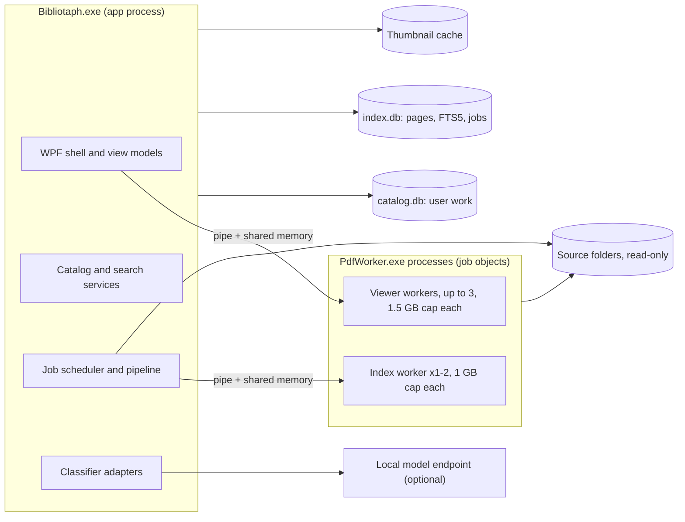

# Bibliotaph architecture

Version 1.0 · agreed by Dave on 8 October 2026 · companion to [product-spec.md](product-spec.md) (v0.3)

One WPF app on .NET 11, PDFium in a small pool of isolated worker processes, two SQLite files (user work in one, a rebuildable index in the other) with FTS5 search, and an in-process durable job queue.

The discussion copy, with comments, is the private [architecture proposal doc](https://claude.ai/code/artifact/c274b66e-807d-487b-af28-4707e03da9d0). This file is the version of record; change it by pull request.

## Decisions

| # | Area | Decision | Why | Alternative if it fails |
| --- | --- | --- | --- | --- |
| 1 | Target framework | .NET 11 (GA November 2026), self-contained; move to .NET 12 LTS in early 2028 | Standard-term releases get 24 months, so .NET 11 and .NET 10 LTS both reach end of support in November 2028 ([Microsoft](https://devblogs.microsoft.com/dotnet/dotnet-sts-releases-supported-for-24-months/)). The spike already runs on 11. | .NET 10 LTS |
| 2 | Process model | One UI process plus a pool of PDFium workers: one dedicated to the viewer, one or two for indexing, each in its own job object | A slow or hostile file being indexed can never stall the page being read | One shared worker |
| 3 | Storage | SQLite, two files: `catalog.db` (user work, migrated, backed up) and `index.db` (derived; upgraded in place when a schema change only adds, otherwise rebuilt), joined with ATTACH | Makes "rebuild never touches user work" (spec §10) a physical guarantee | One database with careful table ownership |
| 4 | Data access | EF Core for `catalog.db`; Microsoft.Data.Sqlite with parameterized SQL (Dapper for reads, reused prepared commands for bulk inserts) for `index.db` and search | FTS5's `MATCH`, `bm25()`, `snippet()` and `highlight()` have no LINQ translation, bulk page inserts need prepared commands in batched transactions, and `index.db` has no migrations. Values are always bound; the `MATCH` string is generated from the parsed query with every term quoted, and column names come from a fixed whitelist, since parameters cover neither. | Dapper everywhere, with hand-rolled migrations |
| 5 | Search engine | SQLite FTS5 (bm25, unicode61 tokenizer, diacritics removed); vectors for Release B later in the same index | Inside the 1-second p95 target for the collection; no second storage engine | Lucene.NET 4.8 |
| 6 | OCR | Windows.Media.Ocr behind `IOcrEngine`, running inside the index worker | Ships with Windows; no native binaries or language data to package | Tesseract 5, which lost the slice 1 bake-off: on 20 pages each of two scanned books Windows OCR scored 81% known words to Tesseract's 73 to 81%, recovered 99% of a digital book's words to 93 to 96%, and took about 250 ms a page to Tesseract's 1.6 to 3.5 s |
| 7 | Job queue | In-process, durable table in `index.db`, run by hosted services | Processing runs only while the app is open; a small scheduler is easier to reason about than a framework | A library queue if the scheduler outgrows that |
| 8 | UI toolkit | WPF with CommunityToolkit.Mvvm and Microsoft.Extensions.Hosting for DI; custom theme from the mockup tokens; no third-party control suite | The mockup is a bespoke editorial look, not Fluent | WPF-UI or the built-in Fluent theme as a base |
| 9 | AI adapter | Local first: an OpenAI-compatible endpoint (Ollama, LM Studio) behind `IClassifier`; endpoint and model configurable | Keeps text on the machine and costs nothing per book. The risk is the 95% precision gate, so the pilot measures it before anything is auto-applied. | Cloud adapter if local precision falls short on the pilot |
| 10 | Content identity | SHA-256 over the whole file, with NTFS file IDs to spot moves without rehashing | The spike hashed a 782 MB book in 456 ms; disk reads dominate, not the algorithm | XxHash128 if hashing shows up in profiles |
| 11 | Installer and updates | Velopack: per-user install, no admin, delta updates from GitHub Releases | Works with an unpackaged WPF app and native PDFium binaries | MSIX |
| 12 | Repository | Public `munkycdev/bibliotaph` under GPL-3.0-or-later (`LICENSE`, third-party notices in `THIRD-PARTY-NOTICES.md`); `spikes/` holds each spike in its own folder (`spikes/pdf-feasibility/`), committed for reference; `docs/` holds the spec and this design | | |

## At a glance

Everything except PDFium runs in the app process. The scanner in the app reads source folders to hash them through the same read-only reader the workers use.

## Process model and isolation

| Runs in | What | Why there |
| --- | --- | --- |
| `Bibliotaph.exe` | WPF shell, view models, catalog and index access, search, job scheduler, classifier adapters, backup | One place owns the databases; no IPC for ordinary work |
| `PdfWorker.exe`, viewer workers | Open, render, tile, find-on-page, character boxes for the documents being read | One per window showing a PDF, up to three (a fourth window shares the least busy, see 4a); never shares a queue with indexing |
| `PdfWorker.exe`, index slots (1 by default, 2 on "use more resources") | Probe, per-page text, covers, OCR of flagged pages | OCR needs a rendered bitmap; keeping it next to PDFium keeps large bitmaps out of the UI process |

Each worker keeps the spike's contract: length-prefixed messages over a named pipe, pixels through a shared memory section, a job object that caps committed memory (1.5 GB for the viewer worker, 1 GB for index workers) and kills the worker if the app dies, and a per-request timeout after which the worker is killed and restarted. Additions for the real app:

- **One process per job object, no children.** `JOB_OBJECT_LIMIT_ACTIVE_PROCESS` = 1. A low-integrity token is a later hardening step.
- **Poison-file memory.** The host records which file and page killed a worker; after two kills on the same page the job fails with that reason, so one bad book cannot loop the queue (A18).
- The message format moves from JSON to a versioned binary or MessagePack format only if profiling shows JSON costs real time.

## Solution layout

| Project | Kind | Holds | References |
| --- | --- | --- | --- |
| `Bibliotaph.Core` | Class library | Domain types (Document, FileLocation, PageRef, Assertion, Collection, SessionPack, Capability), query AST, policies; no I/O | Nothing |
| `Bibliotaph.Catalog` | Class library | EF Core context for `catalog.db`, migrations, backup and restore, JSON and CSV export | Core |
| `Bibliotaph.Index` | Class library | `index.db` schema, page and FTS5 writers, search and facet queries, query parser | Core |
| `Bibliotaph.Processing` | Class library | Source scanner, file watcher, reconciliation, job queue, pipeline stages | Core, Catalog, Index, Pdf.Host |
| `Bibliotaph.Classification` | Class library | `IClassifier`, rule-based hints, prompt and schema versions, evidence validator, adapters | Core |
| `Bibliotaph.Pdf.Contracts` | Class library | Worker messages and framing (from `Spike.Contracts`) | Nothing |
| `Bibliotaph.Pdf.Host` | Class library | Worker pool, job objects, shared sections, restarts (from `Spike.WorkerHost`) | Pdf.Contracts |
| `Bibliotaph.PdfWorker` | Console exe | PDFium and OCR (from the spike's `PdfWorker`) | Pdf.Contracts |
| `Bibliotaph.Viewer` | WPF control library | Virtualized page surface, tiling, highlights, text selection, image viewer (from `ViewerPrototype`) | Core, Pdf.Host |
| `Bibliotaph.App` | WPF exe | Shell, screens, view models, theme, DI composition | Everything above except PdfWorker |

Tests live under `tests/`: unit tests for Core, Index (in-memory SQLite) and Classification; integration tests for Pdf.Host against generated fixtures; and an acceptance harness, grown from the spike's `Harness`, that drives scenarios A01 to A18 against a corpus manifest.

Build-enforced rules: Core and Pdf.Contracts reference nothing; only App knows about WPF windows; only Processing and Pdf.Host open source files, and only through one read-only `ISourceFileReader` (a banned-API analyzer rejects write-capable `FileStream` and `File.Write*` calls elsewhere).

## Storage

Everything lives in `%LOCALAPPDATA%\Bibliotaph\`, never in a synced folder. Both databases run in WAL mode.

| File | Holds | On schema change | Backed up |
| --- | --- | --- | --- |
| `catalog.db` | Source roots, file locations, documents, metadata assertions, vocabulary, ignored folder labels, classification runs, collections, smart views, session packs, notes, rejections, settings | EF Core migration, preceded by an automatic `VACUUM INTO` copy | Always |
| `index.db` | Pages (text, printed label, size, text quality, fingerprint), OCR word boxes for OCR'd pages, FTS5 tables, per-stage status, job queue, and a projection of effective metadata (`doc_meta`, `doc_facet`, `term_alias`) | An additive change runs its embedded `upgrade-N.sql` in a transaction; anything else, or a failed upgrade, drops and rebuilds, and documents re-queue from their content hash. Metadata is projected again from `catalog.db` at startup either way | Optional (spec §10) |
| `cache\` | Covers, thumbnails and page previews as WebP files named by content hash and size | Deleted freely | Never |

Core tables (full schema in slice 0):

- `source_root`: path, volume serial, availability (online, offline, removed by user).
- `file_location`: root, relative path, size, modified time, NTFS file ID, content hash, last seen, state (present, missing, online-only).
- `document`: one row per content version: content hash, format, page count, capabilities with reasons, protection type, `previous_version_id`.
- `assertion`: document, field, value as JSON, origin (embedded, folder, filename, rule, AI, user), evidence pages, run ID, state (provisional, confirmed, rejected, superseded, or awaiting a pending vocabulary term). The effective value is a view over this table, never an overwritten column.
- `page_ref`: document, first and last PDF page, printed labels at the time, page-text fingerprint, label, stale flag. Session pack items and page notes point here.

The UI reads through separate read connections; all writes to `index.db` go through one writer task that batches pages into transactions.

Classification runs live in `catalog.db` beside the assertions they produce, so a rebuilt index never loses a model's evidence or the record of what has already been classified. `index.db` holds only what search needs from metadata (version 3 of its schema):

- `doc_meta`: one row per document with the effective title, system and type labels, publisher, series, authors, tags, level range and state (known, n/a, unknown), whether anything is suggested, and how many Needs review cards it has (`needs_review`, a count), which the sidebar sums.
- `doc_facet`: (document, field, value, label, confirmed) for the closed fields, behind the filter panel and field search.
- `term_alias`: every name of every vocabulary term, so `type:module` finds adventures.
- `doc_fts` gains an `authors` column; its `confirmed` and `provisional` columns carry the effective values as text.

`MetadataProjector` writes these after rule hints, after every user edit and once at startup in the background.

## Files, identity and the processing pipeline

A document is a content hash; a path is where that content was last seen. That gives duplicates (A01), moves (A06) and revisions (A08) without special cases.

**Discovery.** A full scan at startup and on demand; a `FileSystemWatcher` per root feeds the same reconciler while the app is open, debounced until size and modified time stop changing. A path whose size, modified time and NTFS file ID are unchanged is not rehashed. An unreachable root, or one whose volume serial changed, is marked offline as a whole; its files are never marked missing because of it (A07).

**OneDrive.** Online-only files (recall-on-data-access attribute) are always indexed, which downloads each as the queue reaches it. Local files are queued first, first run shows how many files and how much data will download, and the online-only lane pauses if free disk space falls below a threshold (2 GB proposed). Bibliotaph never frees space back to the cloud.

**Stages**, each with its own status (pending, running, complete, partial, blocked, failed, skipped):

1. Fingerprint: SHA-256; a known hash attaches the new path to the existing document and stops.
2. Probe: page count, protection, permissions, page labels, outline, embedded metadata, capabilities.
3. Text: per-page text and text quality; pages with no or garbage text are flagged for OCR. The document is searchable from here (principle 6).
4. Cover and thumbnails.
5. Rule hints: folder names, the file name and the PDF's own information become provisional assertions in `catalog.db`. A folder name counts only when it matches a vocabulary term or alias, and each such folder label can be switched off in Settings > Library folders; an edition implies its system; the deepest folder wins for single-value fields; junk embedded titles and authors ("Microsoft Word - final2.doc") are skipped; levels are read from the file name, title and subject only. Re-running replaces the document's earlier hints and never touches a value the user decided.
6. OCR: flagged pages only, page numbering preserved (A05).
7. Classify: if AI is enabled and allowed for the source.

**Job queue.** A `job` row per document and stage: priority, attempts, not-before time, lease owner, stage version. Jobs are idempotent by content hash, stage and stage version. On startup, stale leases return to pending (A11). Opening a document moves its pending jobs to the front. Concurrency is per lane (index workers, rate-limited classifier); pause is per lane. Disk-full or credential failures block the lane with one visible notice.

**Revisions.** Changed content at a path creates a new document linked to the old one. Page refs on the old version are marked stale, and the page-text fingerprint suggests the matching page in the new edition.

## Search

- **Parser.** A hand-written parser in Core turns `chase "through a city" type:adventure level:3` into an AST. Errors carry a position so the UI can underline the bad token and keep the query. Smart Views store the AST.
- **Documents tab.** `doc_fts` over title, subtitle, publisher, series, authors, tags, notes and effective metadata, with bm25 column weights; confirmed and provisional values in separate columns so ranking can prefer confirmed.
- **Fields.** `publisher:`, `author:`, `series:` and `tag:` match their `doc_fts` columns. `system:` (system or edition), `edition:`, `type:`, `setting:`, `theme:` and `environment:` match a term by key, label or any alias through `doc_facet` and `term_alias`, with `*` prefixes. `level:3` and `level:2-4` match overlapping ranges, `level:none` books with no levels, and `level:unknown` books nobody has levelled. Any field takes `unknown` and `-`. `length:` and `duration:` say they aren't searchable yet.
- **Inside documents tab.** `page_fts` is an external-content table over `page.text`, so `snippet()` quotes the indexed page. Hits are grouped and limited per document in SQL.
- **Highlights.** Not stored; when a hit opens, the viewer worker runs find-on-page for the query terms on that page.
- **Facets.** A `doc_facet` table (document, field, normalised value, confirmed or provisional) refreshed when assertions change; counts are `GROUP BY` over the current result set excluding the facet's own dimension. Levels are system-scoped min and max; unknown is a real value (A12).
- **Coverage.** Results can show "searching text in N of M documents" (A02).

Estimated scale (not measured): roughly 150,000 pages and 350 MB of text for the current 488-PDF collection. Slice 1 measures search latency on the real collection.

## Viewer

The spike's viewer becomes `Bibliotaph.Viewer`, designed so a page never waits for a full-quality render.

1. **Preview first.** A fast render at about a quarter of the target scale, replaced by the full render. Scanned pages decode the whole image at any scale, so their preview comes from page thumbnails cached after first view.
2. **Prefetch and cancel.** Two pages ahead in the scroll direction; requests for pages scrolled out of view are dropped.
3. **Zero-copy hand-off.** `Imaging.CreateBitmapSourceFromMemorySection` over a small ring of shared sections per viewer worker, to avoid copying bitmaps out of shared memory. Needs a proof before it is relied on.
4. **Tiles above 200%.** 512-pixel tiles with an LRU memory budget.
5. **Labels and position.** "Printed p. 42 · PDF page 46 of 180"; last reading position stored separately from search jumps.
6. **Text selection and copy.** For each visible page the viewer worker returns character boxes with the bitmap. Drag to select, double-click for a word, triple-click for a line, Ctrl+A for the page, Ctrl+C copies the selected character range as PDFium extracts it. OCR'd pages select against stored OCR word boxes. If the PDF forbids copying, Copy is disabled with the reason shown.
7. **Known gaps.** Highlight and selection placement on rotated pages; non-ASCII paths, addressed by loading through `FPDF_LoadCustomDocument` with a read-only .NET stream.

JPG and PNG open in an image surface with zoom and pan, decoded at a capped pixel size.

## Metadata and classification

- **Effective value.** Computed per field by `EffectiveMetadata` in Core, never stored. Origins rank user 100, AI 50, rule 30, embedded 20, folder 15, file name 10. For a single-value field the latest confirmed value wins and is never replaced (A04); otherwise the best-ranked suggestion applies and the rest are alternatives. For a multi-value field (types, themes, authors, tags) the value is every confirmed value, plus the top-ranked origin's suggestions that arrived after the user's last decision there; everything else is an alternative, so a field the user settled stays settled until something new is suggested. A closed field (a vocabulary term or levels) needs review when an alternative arrived after the last decision; free text never does by itself.
- **Hints and decisions.** Rule hints are replaced on each run by diffing, so an unchanged suggestion keeps its age. "Keep this" confirms the suggested values, "Use this" makes an alternative the value, typing a value stores a user assertion (a term field resolves the text through the vocabulary or adds the user's own term), and "Reset" returns the field to its suggestions.
- **Rejections.** Stored as (document, field, normalised value); they suppress that value from any origin and any later model.
- **Needs review.** `MetadataReview` in Core decides the cards (slice 2 plan, choice 4): a closed field whose sources disagree, and a document with no usable title (none, or one like "IMG 0042"); with "Review all suggestions" in Settings, also every value nobody has confirmed. A card shows the current value, the suggestion and its evidence. Accept confirms the suggestion; Reject rejects what the card proposes and confirms what the field showed; Edit stores what the user types. Every decision is undone from a snapshot of the field's assertions and rejections taken before it. "Accept all" takes every card proposing the same values for the same field. Suggestions refresh the page only on request, so decided cards keep their Undo.
- **New terms.** A classifier's term the vocabulary doesn't know becomes a pending term, and its values are held (`AwaitingTerm`) out of the effective metadata. Needs review shows one card per term: Add makes it a term and its values suggestions; Map files it under an existing term, whose aliases gain its name; Reject rejects the term and its values, and the same name proposed again is dropped. Each can be undone.
- **Input.** A bounded excerpt: title page, contents, introduction, headings and sampled pages, each tagged with its PDF page number, plus field definitions and vocabulary. Each run records provider, model, prompt version, schema version, content hash and pages analysed.
- **Output.** JSON schema; every field is a value or `unknown`, with evidence pages and a short quote.
- **Evidence check.** Each quote must appear in the indexed text of the page it cites, alongside type, range and vocabulary checks; otherwise the claim is discarded.
- **Untrusted text (A16).** The excerpt goes in a delimited data block, the adapter exposes no tools, and the response can only fill the schema.
- **Adapters.** `Disabled`; an OpenAI-compatible local adapter first (Ollama, LM Studio); a cloud adapter later behind the same interface if the pilot needs it. Settings > AI takes an endpoint URL, lists that endpoint's models, and has a Test button that classifies one sample document. Changing the model never reclassifies on its own: the app offers "Reclassify with this model" with a count of affected documents, and confirmed values are untouched. Never a fallback from local to cloud. Keys live in Windows Credential Manager.
- **Model selection.** In slice 2 the acceptance harness runs the ~100-file pilot against two or three local models and reports precision and coverage for each; the best becomes the default.
- **Vocabulary.** Starter vocabularies with aliases and parent terms in `catalog.db`; new model terms go to vocabulary review unless they match an alias exactly. Settings > Vocabulary adds terms, renames them (the key stays, and the old label becomes an alias) and adds or removes aliases. A name means one term per vocabulary: taking another term's alias moves it, with a note saying so, and another term's own name is refused. Seeding adds starter aliases only to terms new in that starter version, so a removed alias stays removed. After an edit pauses, the library catches up in the background: every document is projected again, then the hints from names run again for every document.

## UI shell

- **Routes.** Home, Library, Collections, Sessions, Needs review, Reading, plus first-run source setup, as in the mockup. A back stack restores search, filters, selection and scroll position when leaving the reader.
- **MVVM.** CommunityToolkit.Mvvm source-generated view models; services from the generic host's DI container.
- **Theme.** The mockup's tokens become brush resources in Light and Dark dictionaries, following the Windows app mode unless overridden.

| Token | Light | Dark |
| --- | --- | --- |
| `bt-bg` | #f9f8f5 | #1d211f |
| `bt-panel` | #fffefc | #242925 |
| `bt-side` | #f0f0e9 | #181d19 |
| `bt-line` | #e3e5dc | #383f38 |
| `bt-text` | #232b26 | #e8ece6 |
| `bt-muted` | #70766d | #adb6ab |
| `bt-accent` | #365847 | #aec9a9 |
| `bt-accent-text` | #fcfcf7 | #1c3023 |
| `bt-soft` | #e4eadd | #303e30 |
| `bt-warm` | #efe8dc | #433c30 |

- **Type and icons.** DM Sans for the interface, Libre Caslon Display for display headings only, both embedded (SIL OFL). Lucide icons as `Geometry` resources (ISC).
- **Cover grid.** The MIT-licensed `VirtualizingWrapPanel` package; covers decoded off the UI thread at display size and frozen.
- **Accessibility.** Per-monitor DPI v2, automation names on every control, keyboard paths for every action, and a 200% scaling pass in slice 0 (A17).
- **Shortcuts.** Ctrl+K global search, Ctrl+F in-book search, Enter open, Esc close.

## Safety, secrets, packaging and updates

- **Source files.** Read-only by construction: one reader, the banned-API analyzer, and the before-and-after hash check as an acceptance test on every corpus run.
- **Passwords.** The unlock prompt has "Remember this password" (off by default). A remembered password is keyed by content hash, so it survives moves and covers duplicates, and lets the index worker process that book unattended. Settings lists remembered passwords with Forget.
- **Secrets.** Saved passwords and API keys go to Windows Credential Manager, local to the machine (not roaming), under a `Bibliotaph:` prefix; never in the databases, logs, exports or prompts. Purge derived content (spec §8) removes a document's pages, FTS rows, thumbnails and cached classifier payloads in one transaction.
- **Logs.** Rolling files in `%LOCALAPPDATA%\Bibliotaph\logs`; page text and passwords are never logged.
- **Backup and restore.** A zip of a `VACUUM INTO` copy of `catalog.db` (optionally `index.db`) with a manifest of source roots for remapping on restore (A15).
- **Installer.** Velopack, self-contained win-x64 (win-arm64 later), per-user, updates from GitHub Releases. Code signing is needed before distributing beyond Dave.
- **Licences.** The app is GPL-3.0-or-later; every dependency is permissive (`THIRD-PARTY-NOTICES.md`). A new package must be permissive or GPL-3.0-compatible: no AGPL (MuPDF, iText, Ghostscript), no revenue-gated licences (ImageSharp, QuestPDF). The build copies `LICENSE`, `THIRD-PARTY-NOTICES.md` and the full third-party texts (each package's licence and any `NOTICE`, the pdfium-binaries `LICENSE` for the pinned version, the OFL files) into the payload's `licenses\` folder. The About popup (4f) shows the version, the Bibliotaph copyright, the GPL's no-warranty line and links that open those files, so the GPL's "Appropriate Legal Notices" are in the UI and forks keep them.
- **PDFium.** Pin the PDFiumCore version, check for new builds each release, keep worker isolation as the second line of defence.

## Spike results and open risks

Gates from the PDF feasibility spike, checked against `spikes/pdf-feasibility/results/20261008-090858` (18 books from the collection and 5 generated fixtures):

| Gate | Target | Result | Verdict |
| --- | --- | --- | --- |
| Source integrity | Zero changes | 22 of 22 files unchanged in hash, size and timestamp | Pass |
| Text and search | Right page, boxes on the words | Expected page and highlight boxes on every file with a text layer | Pass |
| Passwords and damage | Right capabilities, no crash | Wrong or missing password reported; truncated file reported; damaged cross-reference repaired | Pass |
| Open time | Under 500 ms warm, 1.5 s cold | Cold opens 122 to 224 ms | Pass |
| Memory | Under 1 GB, released on close | Peak 803 MB on the 782 MB book; release not measured | Pass, thin margin |
| High-zoom tiles | Under 300 ms | 17 of 18 books under 300 ms; Tome of the Unclean 1,140 ms | Mostly pass |
| Page render p95 | Under 150 ms digital, 400 ms scanned | 11 of 16 digital books over 150 ms (worst 1,058 ms); one scanned book 423 ms | Fail as written |
| Isolation (crash, hang, memory cap) | Worker killed, app carries on | Passed on Linux; Windows self-test not recorded | Unverified |
| Scroll smoothness and fidelity | No blank page after 250 ms | Visual check only | Unverified |

Open risks, in the order to retire them:

1. **Isolation on Windows.** Slice 0 runs the worker self-test in CI on a Windows runner.
2. **Memory headroom.** Viewer worker 1.5 GB, index workers 1 GB; measure release-on-close.
3. **Slow pages.** Preview-first and prefetch must meet the 250 ms no-blank-page bar on the worst books; measured in slice 1.
4. **OCR.** Settled by the slice 1 bake-off: Windows OCR was as accurate as Tesseract and 7 to 14 times faster. It reads multi-column pages column by column, which suits search.
5. **OneDrive hydration.** Placeholder detection, local-first ordering and the low-disk pause are new code.
6. **Non-ASCII paths and rotated pages.** A fixture each.
7. **.NET 11 RC to GA** in November 2026; a rebuild, not a migration.

## Build plan

| Slice | Builds | Done when |
| --- | --- | --- |
| 0. Skeleton | Solution, CI on a Windows runner (build, unit tests, worker self-test, fixture run); shell with theme, fonts, icons, navigation and empty screens; both databases with first schema | App launches in light and dark at 100% and 200% scaling; CI green including the isolation self-test |
| 1. Find and open | OCR bake-off; add folder, scan, hash, probe, text, OCR, covers; job queue; Library grid and list; search with both tabs; viewer with selection opens at the hit | The D&D folder indexed; A01, A02, A03, A05, A11, A14, A18 pass; search p95 under 1 s measured |
| 2. Catalog automation | Assertions, rule hints, local AI adapter with model settings, evidence check, inspector with evidence, Needs Review, vocabulary | Pilot of ~100 files meets the §12 precision and coverage gates; A04, A12, A16 pass |
| 3. Preparation | Favourites, collections, Smart Views, session packs with page ranges, run mode, Home | A13 passes; one real session prepared and run from the app |
| 4. Features and hardening | First Dave's features, one PR each (see [Slice 4 features](#slice-4-features)); then moves, offline roots, revisions, passwords and DRM, backup and restore, export, the installer with the full `licenses\` folder, accessibility pass | Each feature's own "done when"; A06 to A10, A15, A17 pass; installed through Velopack on a second account |

## Slice 4 features

Features Dave asks for during slice 4 are designed one at a time in the "Slice 4 plan" tab of the planning doc, with a choice table each, and ship before the hardening PRs so the installer test and the accessibility pass cover them. Dave left every Decision cell blank, so each recommendation below stands. Small asks that are really bugs or gaps go straight to main instead (dark-theme list text, word-start search, the clickable breadcrumb, zoom buttons).

- **4a Pop-out windows.** A reader-only window (toolbar, page box, zoom, Contents, find, selection) per book, opened by Pop out (moves the open book; the main window goes Back), Open in new window (card menu, inspector, search hit, Shift+Enter or middle-click) and Return to main window. Any number of windows, the same book twice allowed. Each is an unowned top-level window; the last placement is kept in the settings table and pulled back onto a visible monitor. Closing the main window closes them all; Esc never closes one, Ctrl+W does; none reopen at launch. Each PDF window gets its own viewer worker, up to three (a fourth window shares the least busy), through viewer leases on `PdfWorkerPool`; an unlocked password is reused from memory. `ViewerViewModel` takes its request at creation, so the Reading route and the new window host the same view model and view.
- **4b Search field guide.** A popup under the search box on focus when it is empty (Ctrl+Space at any time) lists the search fields with a one-line meaning and an example, narrowing to the field name at the cursor; after a closed-vocabulary field's colon it lists that field's values with book counts from `doc_facet`. Picking inserts the field and keeps focus; Esc closes it and a second Esc clears the search as before. Field definitions move out of the parser into one public list in Core that the parser, its errors and the popup share.
- **4c Reprocess a file.** Reprocess in the details panel re-runs every file-reading stage (hash, probe, text, covers, hints, OCR where needed) but never AI classification, keeps everything the user made in `catalog.db` and keeps the old text searchable until the new text lands. A `JobBoard` reset puts the book's jobs back to waiting at the front of the queue (re-adding is a no-op, since jobs are unique by content, stage and version), so it also serves as Retry. A menu adds "Reprocess with OCR on every page" (asks first, with the page count); "Ask the AI again" follows slice 2c.
- **4d One Settings page.** Library folders folds into Settings, which gets a section list down its left (Library, Processing, Appearance, then AI, Vocabulary, Passwords and About as they arrive); the folder list scrolls with its section rather than in a nested box. Built after slice 2b, which also changes Settings.
- **4e Bulk metadata editing.** Select mode in the Library's Documents tab (checkboxes in grid and list, Shift ranges, Ctrl+A, kept across searches) and one dialog for every field but Title: single-value fields show the shared value or Mixed, multi-value fields are chips with counts, untouched fields don't change, and a value set is confirmed on every book. A summary flags values that override the user's own before applying, and Undo restores a snapshot. Writes go through new bulk `MetadataStore` calls in one transaction. Built after slice 2b; slice 3's collections reuse the selection.
- **4f About popup.** Replaces the planned Settings > About page: a small dialog from the window's system menu and Settings with the version (0.N.0 per slice in `Directory.Build.props`, plus the commit), the copyright, the GPL line, links to the licence, notices, source and issues, Copy details (version and builds, never paths), and a reader for the files in `licenses\`.

Tabs for open files are listed in the plan to discuss later, with no design yet.
