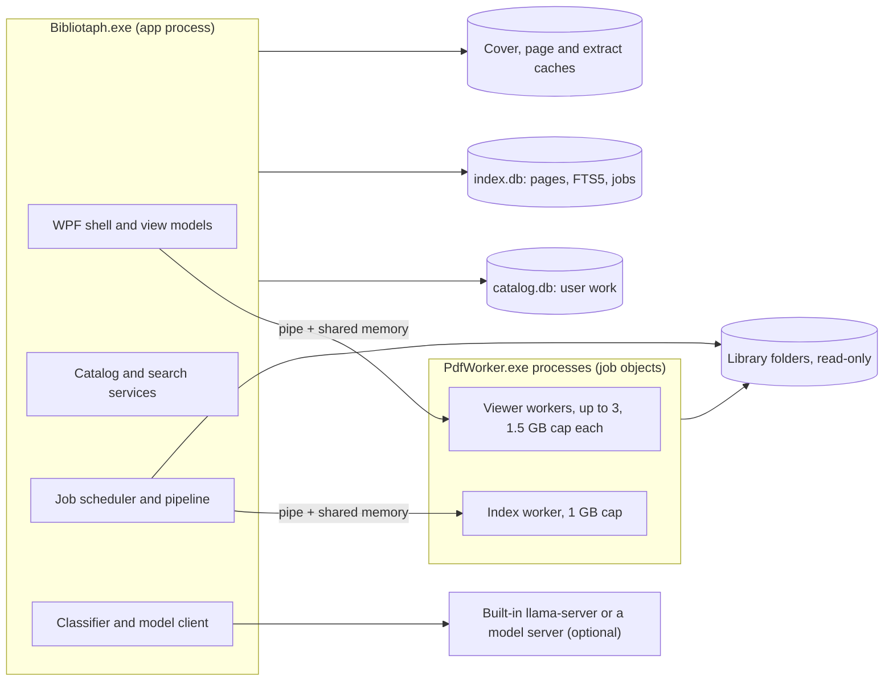

# Bibliotaph architecture

This describes the design of Bibliotaph 1.3. For what the app does, see [features.md](features.md); for how to use it, the [user guide](guide/getting-started.md).

## At a glance

Bibliotaph is one WPF app on .NET 11. PDFium runs in a small pool of isolated worker processes; e-books are read by managed code in the app. The user's work lives in one SQLite file and a rebuildable search index in another, searched with FTS5, and an in-process durable job queue reads the library in the background. Bibliotaph catalogs files where they are and never writes to a source file.

```mermaid
flowchart LR
  subgraph App["Bibliotaph.exe (app process)"]
    Shell["WPF shell and view models"]
    Services["Catalog and search services"]
    Scheduler["Job scheduler and pipeline"]
    Classifier["Classifier and model client"]
  end
  subgraph Workers["PdfWorker.exe processes (job objects)"]
    Viewer["Viewer workers, up to 3, 1.5 GB cap each"]
    Indexer["Index worker, 1 GB cap"]
  end
  Shell -->|pipe + shared memory| Viewer
  Scheduler -->|pipe + shared memory| Indexer
  Classifier --> AI["Built-in llama-server or a model server (optional)"]
  App --> Catalog[("catalog.db: user work")]
  App --> Index[("index.db: pages, FTS5, jobs")]
  App --> Cache[("Cover, page and extract caches")]
  Workers --> Sources[("Library folders, read-only")]
  Scheduler --> Sources
```

## Key decisions

| Decision | Why |
| --- | --- |
| .NET 11, self-contained, per-user | Its support runs to November 2028, the same as .NET 10 LTS; self-contained means nothing to install first. |
| One UI process plus PDFium worker processes, each in a job object | A slow, damaged or hostile PDF being indexed can't stall the page being read or crash the app. |
| Two SQLite files: `catalog.db` (user work) and `index.db` (derived) | "Rebuilding the index never touches the user's work" is a physical fact, not a convention. |
| EF Core for `catalog.db`; Microsoft.Data.Sqlite with Dapper and prepared commands for `index.db` | FTS5's `MATCH`, `bm25()`, `snippet()` and `highlight()` have no LINQ translation, bulk page inserts need prepared commands in batched transactions, and `index.db` has no migrations. |
| SQLite FTS5 for search (bm25, unicode61, diacritics removed) | Fast enough for a large personal collection, with no second storage engine. |
| E-books cut into pages by a fixed rule over their content, read in the app process by managed code | Search, evidence, notes and binders all point at pages, so an e-book needs pages that never move: a rule over the file's content gives the same pages on every PC, unlike pages laid out by a renderer. There is no native library to contain, so no worker process; size limits guard against hostile archives instead. |
| Windows.Media.Ocr, inside the index worker | Ships with Windows, so no native binaries or language data to package; in a comparison it was as accurate as Tesseract and 7 to 14 times faster. |
| An in-process, durable job queue in `index.db` | Processing runs only while the app is open; a small scheduler is easier to reason about than a framework. |
| WPF with CommunityToolkit.Mvvm and the generic host; a custom theme, no control suite | The design is a bespoke editorial look, not Fluent. |
| AI local first: a built-in llama.cpp engine or an OpenAI-compatible server (Ollama, LM Studio), never a cloud fallback | Book text stays on the machine and costs nothing per book. AI is optional and only suggests. |
| Content identity is SHA-256 of the whole file, with NTFS file IDs to spot moves | Duplicates, moves and revisions fall out without special cases; disk reads, not the hash, dominate the cost. |
| Online libraries through the real site in WebView2 | The user signs in on the service's own page; Bibliotaph keeps no password and reads only what the page shows. |
| Library sync through per-device files kept by the web library | Every PC and the web get the same work without syncing a live database; the PCs' files meet in one place the user already signs in to. |
| Velopack installer and updates from GitHub Releases | Per-user install with no admin, delta updates, and it works with an unpackaged WPF app and native PDFium binaries. |
| GPL-3.0-or-later, with permissive or GPL-compatible dependencies only | The app is free software, and every shipped component can be redistributed under it. |

## Process model and isolation

| Process | Does | Why there |
| --- | --- | --- |
| `Bibliotaph.exe` | Shell, view models, catalog and index access, search, the job scheduler, classification, backup, sync | One process owns the databases, with no IPC for ordinary work. |
| `PdfWorker.exe`, viewer workers | Open, render, tile, find on page, character boxes and links for the books being read | One per reader window showing a PDF, up to three; more windows share the least busy. A reader never shares a worker with indexing. |
| `PdfWorker.exe`, index worker | Probe, page text, covers, OCR of flagged pages, reading a download being checked | OCR needs a rendered bitmap; keeping it beside PDFium keeps large bitmaps out of the app. |
| `aiworker\llama-server.exe` | The built-in AI's model, only while it has work | A native crash or running out of graphics memory takes down only that process. |

`PdfWorkerPool` (Pdf.Host) starts workers on first use and stops a viewer worker when its last reader lets it go. Each worker talks length-prefixed JSON messages over a named pipe and returns pixels through a shared memory section, which the viewer copies into a frozen bitmap. Each runs in its own job object that caps committed memory (1.5 GB for a viewer worker, 1 GB for the index worker), allows one process and no children, and kills the worker if the app dies. A request that times out kills and restarts the worker. `PoisonTracker` remembers which file and page killed a worker; after two kills on the same page the work is refused with that reason, so one bad book can't loop the queue.

Indexing reaches PDFs only through `IPdfEngine` (Pdf.Contracts): open a file, then read its pages' text, draw a page, or OCR one. On Windows that is `WorkerPdfEngine` (Pdf.Host) over the index worker, which opens the document again if the worker restarted. The seam is there so the stages can run where the worker can't, such as a web version with PDF.js; such an engine answers `OcrUnavailable` for OCR it doesn't have, which blocks the OCR stage with a reason. Engine failures are `PdfEngineException`s, the worker's included: the lane retries the job unless the exception says trying again can't help, as for a page that has killed the worker twice. The viewer still uses the pool directly.

The worker opens a PDF through `FPDF_LoadCustomDocument` over a read-only .NET stream, so PDFium never sees the path (names outside the ANSI code page open like any other) and the file is never opened for writing.

## Solution layout

| Project | Holds | References |
| --- | --- | --- |
| `Bibliotaph.Core` | Domain types and enums, the search query parser and field list, effective metadata, page fingerprints, watermark detection, part rules, sync file format and merge; no I/O | Nothing |
| `Bibliotaph.Catalog` | EF Core context and migrations for `catalog.db`, the stores for user work, backup files, JSON and CSV export, applying library sync records | Core |
| `Bibliotaph.Index` | `index.db` schema and upgrades, page and FTS5 writers, search, facet and library queries, the job board | Core |
| `Bibliotaph.Ebooks` | The EPUB and Kindle readers (package, contents, page list, cover, DRM check), HTML to text blocks with AngleSharp, the page cut and the reader page; reads only from a stream | AngleSharp |
| `Bibliotaph.Classification` | `ModelClassifier`, model client, prompts and schemas, excerpt builder, evidence check, rule hints, Ask's prompts and checks | Core |
| `Bibliotaph.Processing` | Scanner, watcher, reconcile, hashing, ZIPs, the pipeline and its stages, metadata projection, built-in AI engine and downloads, Ask, online library readers, backups, library sync | Core, Catalog, Index, Classification, Ebooks, Pdf.Host |
| `Bibliotaph.Pdf.Contracts` | Worker messages and framing, and `IPdfEngine`, the PDF engine indexing uses | Nothing |
| `Bibliotaph.Pdf.Host` | Worker pool, job objects, shared sections, restarts, poison tracking, `WorkerPdfEngine` | Pdf.Contracts |
| `Bibliotaph.PdfWorker` | PDFium and OCR: Windows OCR, or Tesseract on the web server (console exe) | Pdf.Contracts |
| `Bibliotaph.Viewer` | Virtualized page surface, tiles, highlights, selection, links, image view | Core, Pdf.Host |
| `Bibliotaph.App` | Shell, pages, view models, theme, WebView2 windows, Windows-only services, DI composition | Everything above except PdfWorker |
| `Bibliotaph.Api.Contracts` | The web API's request and response records, shared by the server and its clients | Nothing |
| `Bibliotaph.Server` | bibliotaph.online: ASP.NET Core host, sign-in, accounts and invitations (`accounts.db`), storage connections, each user's catalog, index and indexing, the API, and the container it ships in | Api.Contracts, Catalog, Index, Processing, Storage, Web |
| `Bibliotaph.Storage` | Connected storage behind one seam (`IStorageDrive`): listing library folders, downloading a book to a temporary file, change signals; a folder per provider, such as `OneDrive/` for Microsoft Graph's REST API and its change subscriptions | Processing |
| `Bibliotaph.Web` | The browser app, Blazor WebAssembly, styled and iconed like the Windows app | Api.Contracts |

Core and Pdf.Contracts reference nothing, and only App knows about windows. A banned-API analyzer rejects write-capable file APIs everywhere except Processing, Pdf.Host and PdfWorker. Processing opens library files only through `ISourceFileReader`, which has no write path; the worker opens them read-only. Both share read, write and delete, so Bibliotaph never stops the user or a sync client from changing a file.

`tests/` holds unit and integration tests per project with generated fixtures; `tools/` holds the licence notice generator and other build helpers; `build/` holds the verify script and the built-in AI engine pin.

## Storage

Everything lives in `%LOCALAPPDATA%\Bibliotaph\`, never in a synced folder. Both databases run in WAL mode; the UI reads through separate connections, and all writes to `index.db` go through one writer that batches pages into transactions.

| File | Holds | On schema change |
| --- | --- | --- |
| `catalog.db` | Everything the user made or decided, and what can't be derived again | An EF Core migration, after an automatic `VACUUM INTO` copy |
| `index.db` | Everything derived from files or projected from `catalog.db` | An additive change runs its embedded `upgrade-N.sql` in a transaction (schema version 19); anything else, or a failed upgrade, drops the file and rebuilds it, re-queuing documents by content hash |
| `cache\` | Covers by content hash; page thumbnails per book (`cache\pages\`, trimmed past 256 MB, least recently opened first); files extracted from ZIPs (`cache\extract\`, trimmed past 5 GB); site icons | Deleted freely; never backed up |

Beside them are `backups\`, `logs\`, the covers users chose for books owned elsewhere (`covers\`, which nothing could rebuild), the WebView2 profiles (`browser\` for online libraries, `ebook-reader\` for the e-book reader), the built-in AI's downloaded engine (`engine\`) and models (`models\`).

### catalog.db

- **Files and documents.** `source_root` (path, volume serial, availability), `file_location` (root, relative path, size, modified time, NTFS file ID, content hash, state: present, missing or online-only; a file inside a ZIP points at its ZIP and records its entry path and CRC) and `document`, one row per distinct content (hash, format, page count, capabilities, protection, and the page the user chose as its cover).
- **Entries.** An `entry` is what the library lists and the user catalogs: a whole document, a part (an adventure inside a file), a pack of images, or a book owned elsewhere with no file. `entry_source` says which documents an entry shows, with a page range for a part, and which is current. Joins (`entry_join`) record the rows they moved, so Undo and "Not the same book" can move them back. `copy_decision`, `version_proposal`, `elsewhere_match`, `pack_decision` and `part_proposal` remember the user's answers to Match, packs and parts, so nothing is asked twice.
- **Metadata.** `assertion` holds every value with its origin (embedded, folder, file name, rule, folder rule, user tag, AI, user), evidence pages and quote, run and state. The effective value is computed from it, never stored over it. `rejection`, `vocabulary_term`, `vocabulary_alias`, `ignored_folder_label`, `folder_rule`, `user_tag`, `correction_request`, `classification_run` and `chapter_scan` (a whole-book scan's chapters and findings, by content hash) sit beside it, so a rebuilt index never loses a model's evidence or the record of what was read.
- **The user's own things.** `favorite`, `reading_state`, `collection` and `collection_item`, `collection_folder` (folders made into collections, or declined), `collection_decline` (books declined for a collection), `smart_view` (saved searches), `pin`, `note`, `session_pack`, `session_section` and `session_item` (binders), `page_ref`, `ask_turn` (Ask this book conversations), `setting` and `sync_state`.

A `page_ref` is a page range on a document, with the printed label and page fingerprint of its first and last pages, so binder items and page notes can be found again in another copy or version.

### index.db

Pages, OCR word boxes, outlines, per-stage status and jobs are keyed by document. `page` holds each page's text, printed label, size, text quality and fingerprint; `page_fts` is an external-content FTS5 table over its text; `page_vec` holds Ask's page vectors, tagged with the embedding model and text version, and dropped by triggers when a page's text changes. `chapter` and `chapter_tag` hold the chapters of books the AI read whole and what it found in each, projected from `chapter_scan`.

What the library lists is keyed by entry and projected from `catalog.db` by `MetadataProjector`: `entry_doc` (the document an entry shows, its kind, copies and cover), `entry_member` and `member_fts` (a pack's images), `entry_meta` (effective title, labels, levels, players and review counts), `entry_facet` (closed field values behind the filter panel and field search), `term_alias`, `entry_fts` (the Documents tab's columns, including notes), `entry_ai` (which entries a model has read), and the user's marks: `entry_scope` (favorites, collections, binders), `scope_name`, `entry_note` and `entry_opened`.

Projection runs after hints, user edits, classification, packing and sync, and once at startup in the background, one projection at a time. A heart or an open projects only the marks. Because metadata is projected again at every start, an index rebuild loses nothing the user did.

## Files, identity and the processing pipeline

A document is a content hash; a path is where that content was last seen. Two paths with the same hash are copies of one document, a path that moves keeps its document, and new content at a path is a new document.

### Discovery and reconcile

A full scan runs at startup and on demand, and a `FileSystemWatcher` per root feeds the same reconciler while the app is open, debounced until size and modified time settle. A path whose size, modified time and NTFS file ID are unchanged isn't hashed again. A new path whose file ID, size and time match a location that left its own path is that file moved, and keeps its card. Where the disk keeps no file IDs (FAT, exFAT), a file that left one path and arrived at another in the same scan, with the same name, size and time, is taken as moved when nothing else could pair with either; anything ambiguous is hashed and finds its card by content.

Where a root lives is behind interfaces, so the scan and reconcile can run against a drive that isn't a Windows folder, such as a cloud drive in a web version. `ISourceLister` lists a root without opening a file: every file with its size, time and whether it is online-only, and the folders it couldn't read. On Windows that is `FileSystemSourceLister`, which doesn't follow links and leaves out folders that are roots of their own. `SourceScanner` then decides which files are read and counts the rest, the same for any lister. Files are opened through `ISourceFileReader`, disks and file IDs come from `IFileIdentity`, and changes from `IFolderWatcher`. Library paths stay strings: another drive mounts as a rooted path of its own, such as `/onedrive/<drive id>/Books`, with its item IDs as file IDs and its drive ID as the volume serial, so the catalog, the reconciler and library sync don't change.

An unreachable root, or one whose volume serial changed, goes offline as a whole; its files are never marked missing because of it. Opening a book whose file can't be reached shows a prompt that names the drive or the last folder, with a rescan to find it.

### ZIPs

A ZIP is read in place through the read-only reader with System.IO.Compression and never unpacked beside itself. The ZIP is a location with a hash and no document; each PDF or image inside is a location of its own, hashed as it is decompressed, and joins documents by hash like any file, so a book both loose and zipped is one document and the loose file is preferred. A ZIP saved again keeps the hashes of members with the same name, size and CRC, and a moved ZIP isn't read again. Stages and the viewer get a member extracted to `cache\extract\` and checked against its hash. A member that can't be read (a nested ZIP, a password, too big, damaged) is listed in Files needing attention.

### E-books

An EPUB is a document like a PDF: hashed, joined by content, found in ZIPs (an `.epub` is itself a ZIP, but is never listed as an archive of members) and never written to. Probe, Text and Covers read it in the app process through `EbookFiles` (Processing) and `EpubBook` (Ebooks), over the read-only reader's stream; OCR never runs on it.

- **Package.** `META-INF/container.xml` names the package; its metadata, manifest and spine give the title (the one refined as main), authors, publisher, date, ISBN (by check digit), subjects, description, reading order and fixed layout. The contents come from the EPUB 3 navigation document, else the EPUB 2 NCX, and become the outline. The cover is the manifest's `cover-image`, else EPUB 2's `<meta name="cover">`, else the first image of the guide's cover page or the first chapter.
- **Pages.** `EbookPaging` cuts the book into pages, which `page` stores as it stores a PDF's (`pdf_page` is the page's index, `text_source` is `pdf`, the file's own text, and the size is a nominal 6 by 9 inches). A fixed-layout book has a page per spine item. A book that marks its printed pages (a page list whose entries resolve, else `epub:type="pagebreak"` or `role="doc-pagebreak"` markers, at least 3) has those pages with their labels, what comes before the first cut as below. Otherwise each spine item starts a page, and a page ends before the block (paragraph, heading, list item, table row) that would take it past 2,500 characters, or before a heading once it holds 1,250; a longer block is split after a sentence. Each page starts at a locator (chapter, block, character), which the reader will use to show it. The rule depends only on the file, so page numbers are the same on every PC; `EbookPaging.Version` records it, and changing it would move every place that points into an e-book.
- **Text.** AngleSharp's HTML5 parser reads each chapter, after closing XHTML's self-closed elements (`<a id="x"/>`), which an HTML parser would otherwise leave open. Scripts, styles and SVG are skipped, nesting deeper than 256 is read as plain text, and the regular expression that closes elements doesn't backtrack.
- **Metadata.** The package's title and authors fill the fields a PDF's document information does, its publisher and subjects go with the keywords (matched against the vocabulary) and its description is the subject (where levels and party sizes are looked for), so rule hints treat both formats alike.
- **Limits.** Bytes actually decompressed are counted, whatever the archive claims: at most 64 MB an entry, 512 MB a book and 20,000 entries. XML is read with DTDs ignored, no resolver and no entity expansion.
- **Kindle books.** `Ebook.Open` tells formats by their bytes: a ZIP is an EPUB, a Palm database of type `BOOKMOBI` is `MobiBook`, and KFX (`\xeaDRMION\xee` or `CONT`) and Topaz (`TPZ`) are refused with a reason. `MobiBook` reads record 0's PalmDOC, MOBI and EXTH headers (title, authors, publisher, description, ISBN, subjects, date, language, cover, fixed layout), and prefers a KF8 version (version 8 in record 0, or the record EXTH 121 names in a file with both). Text records are decompressed (PalmDOC LZ77, or HUFF/CDIC with a nesting limit), their trailing entries cut by the extra-data flags, within the same byte limits as an EPUB. KF8 text is cut into flows by FDST; the HTML flow is put back into its files from the skeleton and fragment indexes (INDX records, their TAGX tags and CNCX strings), and the other flows become stylesheets and SVG. An older book's one HTML text is cut into parts at `<mbp:pagebreak>`, with empty parts joined to the next. Links by position (`filepos`, `kindle:pos:fid:off`) and the contents index's positions get ids at those places (the element starting there, or an empty anchor), `kindle:embed` and `recindex` become image and font paths numbered from the first resource record, and `kindle:flow` the flow files. Without a contents index, an older book's contents are the links on the page its guide names. The parts' paths are made up (`part0000.html`, `image00001.jpg`), so paging, indexing and the reader treat it as an EPUB through `IEbook`. A non-zero encryption field is DRM, read as protected like an EPUB's.
- **DRM.** An EPUB whose spine is listed in `META-INF/encryption.xml` under anything but font obfuscation (IDPF or Adobe), or whose encryption list can't be read, is protected: Probe records its package (so the card has its title and authors) with protection Unsupported, and Text fails with `TextAccessReasons.ProtectedEbook`, which the library reads as Protected.

- **Reader.** The viewer cuts the book again on open (the same rule, so the same pages) and `EbookReaderDocument` builds one HTML page of it: a `<section>` per spine item and an empty `<bt-page>` marker where each page starts, placed from the page's locator (splitting a text node for a page that starts inside a block). The book's HTML is cleaned on the way: scripts, styles, frames, forms, objects and media are dropped, attributes are an allowlist, ids are prefixed per chapter and internal links rewritten to them, web links kept for the app to open, and images point at `/res/` paths. A fixed-layout book gets a sandboxed `<iframe>` per page, sized from its viewport, whose page is cleaned the same way and keeps its stylesheets.
- **Browser.** `EbookView` shows that page in WebView2 (`WebView2CompositionControl`, so the reader's notices draw over it) with a profile of its own (`ebook-reader\`), at `https://book.bibliotaph.invalid/book.html`. Every request the page makes goes through `WebResourceRequested`: the page, the book's pictures, fonts and stylesheets from the open archive (`EbookContent`), or a 404. The page's Content-Security-Policy allows only the app's own style and script by a nonce made per open; nothing is cached, navigation, new windows, downloads, permissions and external schemes are refused, and the context menu keeps Copy and Select all. `reader.js` and `reader.css` (embedded in the app) report the page in view (the last marker above a reading line), find text, mark search terms with the CSS Custom Highlight API, and pass links, selection, keys and zoom to the app as web messages.

### Online-only files

Files in OneDrive and other cloud-files folders are always indexed, which downloads each as the queue reaches it. Local files go first, and online-only files wait while downloading the next would leave less than 2 GB free. Once a file that was online-only has been read by every stage that reads files, Bibliotaph returns it to online-only with `CfSetPinState(CF_PIN_STATE_UNPINNED)`, which is what Explorer's "Free up space" does; content, path and timestamps don't change. A file the user pinned to the device, one open in the reader, or one the platform refuses stays. This lets a library larger than the disk be indexed in turns, and Settings can switch it off. `CloudFiles`, behind `ICloudFiles`, is the only caller of the cloud files API. Sync apps that stream through their own drive and cache rather than placeholders are left alone.

### Stages

Each stage has its own status per document (pending, running, complete, partial, blocked, failed, skipped) and a version; bumping a version re-runs that stage, and only that one, everywhere.

1. **Fingerprint.** SHA-256; a known hash attaches the path to the existing document and stops. ZIPs are listed here.
2. **Probe.** Page count, protection, permissions, page labels, outline, embedded metadata, capabilities. An e-book is cut into pages here.
3. **Text.** Per-page text and text quality; pages with no or garbage text are flagged for OCR. The book is searchable from here.
4. **Covers.** A PDF's first or chosen page, an image itself, or an e-book's cover image.
5. **Rule hints.** Folder names, the file name and the PDF's own information become provisional assertions (see Metadata).
6. **OCR.** Flagged pages only, page numbering kept.
7. **Match.** Fingerprints each page from stored text and finds copies and new versions (see Copies and versions), then checks the book against the user's tags (see User tags).
8. **Classify.** Has the AI read the book, when AI is set up and on (see Metadata).
9. **Chapter scan.** Once Classify is done, has the AI read the whole book a batch of chapters at a time (see Whole-book scans).

Stages 2 to 6 read the file; Reprocess runs them again while the old text stays searchable. Match and Classify read only stored text, wait for the book's OCR, and backfill existing libraries without opening a PDF.

### Job queue and lanes

A `job` row in `index.db` per document and stage holds priority, attempts, not-before time, lease and stage version, unique by content hash, stage and version, so enqueueing is idempotent. Stale leases return to pending at startup. Opening a book moves its pending jobs to the front.

Jobs run in three lanes, each with its own concurrency and pause: Index (probe, text, covers, hints, match), OCR (slow, so it never holds up the next book's text) and Classify (one book at a time, with chapter scans at the lowest priority). A failure retries with backoff; disk-full or credential failures block the lane with one visible notice. A job that waits for another of its book's stages (Classify for OCR, say) is made ready when that stage ends, and its lane is woken then rather than at its next look. While a model server isn't answering, Classify jobs wait and the lane retries every minute rather than failing; a book the server fails on while it still answers other requests fails alone.

## Books, copies, versions, packs and parts

**Copies and versions.** Match fingerprints each page as lowercase letters and digits, dropping lines that repeat on half the pages (running heads, per-buyer watermarks). A document with the same page count and every fingerprint equal (at least 3 pages, and at least half, fingerprinted) is the same book, and its card joins the older one as a copy. User values come along; a single-value field the two confirmed differently is set aside for a "Copies disagree" card. Otherwise a file sharing at least 60% of its pages with a book, or failing that its title and publisher, is proposed as a new version. Same book in Select mode joins cards by hand the same way. An entry with several sources has one current source, which opens; when its files are all gone the newest copy with a file opens instead.

**Places across versions.** Binder items, page notes and reading places point at page ranges on a document. In another copy or version, `PagePlaces` finds each by its first and last page fingerprints once that version has them; a place not found opens at the same printed page marked "This page changed: check it", and Needs review lists them per version with Use this page.

**Packs.** A folder or ZIP of 20 or more images and no PDF becomes one card, named after it, unless the user split it; 5 to 19 images, or images beside PDFs, are proposed instead. Each member keeps its own entry, pointing at the pack as its parent. The decision is kept by path and follows the folder or ZIP when it moves. Pack together makes or merges packs by hand, through the same join records, so Undo works the same way; a pack made by hand can hold PDFs too (never a PDF with parts), and their pages are found under the pack. **Each file** is a query-time view, not a projection: with `LibraryFilter.PackFiles`, `LibraryQueries` reads its cards from `entry_doc` with each pack's row replaced by a row per `entry_member`, carrying the pack's `entry_id` (so `entry_meta`, facets, scopes and `entry_fts` apply as to the pack) with the file's `document_id` and its own entry as `pack_file`, which tells cards apart and owns the file's page hits. Members stay out of `entry_doc`, so Needs review and the counts outside the Library still see only packs. A pack's cover is a mosaic of its first four files unless the user chose one: `entry.cover_entry_id` names that member's entry, which follows the file through rescans and moves. The projection writes it to `entry_doc.cover_member` only while that member is in the pack with a file, so a file that leaves gives the card its mosaic back at the next projection rather than a dangling cover.

**Parts.** An adventure inside a compilation can be a card of its own: an entry of kind Part whose sources are page ranges in each copy of the file, one span each, never overlapping. The file is never split. Parts come from the reader's bookmarks or a page range, or from proposals. A proposal needs the book's own statement that it is a collection of separate adventures, found on its description pages (those before the first adventure, within the front matter, and the back cover), because campaign books print a level blurb at the start of every chapter. `PartRules` finds that statement with patterns ("a collection of five adventures", "one-shots", "each can be run on its own", with linking words such as "form a campaign" ruling a sentence out) and the starts from bookmarks and adventure blurbs ("for four characters of 3rd level"). When AI is on and the rules proposed nothing, the model reads the description pages too and must quote the statement before picking among the same bookmark candidates; the check wants that quote on a page the model was shown and about several separate adventures (`PartRules.DescribesCollection`), and each adventure's quote on its own pages. The statement is stored with the proposal and shown on its Needs review card. A blurb's quote takes in the party size written around it ("four to six 5th-level characters"), which `PartRules.Party` reads back, so accepting suggests each adventure's levels and players with the blurb as evidence; an adventure marked by hand gets the same suggestions, with origin rule, from the blurb on its first two pages (`PartRules.ReadBlurb`). A proposal never makes cards until accepted. A part inherits the file's system, edition, publisher, series, year and setting as values of its own source, never over what the user set on it, and is classified on its own pages. `PartsService.FollowAsync` finds each part again in every copy and version by its first and last page fingerprints. Browsing lists parts inside their file, whose card counts them; a search lists a matching part as a card of its own, in place of its file when both match, and More filters can show parts as cards while browsing or hide them. In Inside documents, a page is listed under the part it falls in, else under its file.

**Owned elsewhere.** A book owned in print or on a virtual tabletop is an entry with no sources, cataloged by the user's own values, with an Also own field naming where. A file whose title matches such a book, with no publisher that says otherwise, gets an "Is this its file?" card; accepting joins them.

**Check a download.** Hashes a folder or ZIP against the library without adding anything: a known hash is Already owned; other PDFs are read in the index worker and their page fingerprints and hint title and publisher compared as Match would. Nothing is written to either database or the queue.

## Search

- **Parser.** A hand-written parser in Core turns `chase "through a city" type:adventure level:3` into a query tree. Errors carry a position, so the box can underline the bad token and keep the query. One field list in Core serves the parser, its errors and the search field guide under the box. Values are always bound as parameters; the FTS5 `MATCH` string is generated from the parsed query with every term quoted, and column names come from a fixed list.
- **Documents tab.** `entry_fts` over title, subtitle, publisher, series, authors, tags, notes and effective metadata, with bm25 column weights; confirmed and provisional values sit in separate columns, so confirmed ones rank higher. Words also match the file names of images in packs.
- **Fields.** Text fields (`title:`, `publisher:`, `author:`, `series:`, `tag:`) match `entry_fts` columns. Term fields (`system:`, `edition:`, `type:`, `setting:`, `style:`, `theme:`, `environment:`, `duration:`, `own:`, `store:`) match a vocabulary term by key, label or alias through `entry_facet` and `term_alias`, with `*` prefixes. `setting:`, `theme:` and `environment:` also match the `inside:` facets a whole-book scan projects from `chapter_tag`, and `creature:` matches only those. `level:` and `players:` match overlapping ranges. `favorite:`, `collection:`, `where:` (here or elsewhere), `format:` and `folder:` filter by marks and places. Any field takes `unknown` and `-`.
- **Inside documents tab.** `page_fts` over page text, with `snippet()` quoting the page; hits are grouped and limited per book in SQL. Highlights aren't stored: opening a hit runs find on that page in the viewer worker.
- **Facets.** Counts are `GROUP BY` over `entry_facet` for the current results, leaving out the facet's own dimension. Levels are ranges per system; unknown is a real value.
- **Coverage.** While books are still being read, results say "Searching text in N of M documents".
- **Saved searches.** A saved search stores the search text, scope, filters, order, layout and tab as versioned JSON, never a list of books, so opening it runs the search again.
- **Ask.** A mode of the search box that has the AI turn a plain-English request into ordinary search terms. `PlainSearchPrompt` sends only the request (cut to 500 characters, in guarded tags) and the vocabulary's names; the answer can only fill a schema of field filters and words. `PlainSearchCheck` drops any field the box doesn't have, any vocabulary value that isn't a term, and any word that isn't the user's own; every kept piece must parse with the box's own parser, and every change is explained. The pieces show as editable chips, and nothing runs until the user presses Search, which puts them in the box as query text.

## Viewer

`Bibliotaph.Viewer` is built so a page never waits for a full-quality render.

1. **Preview first.** A render at a quarter of the target scale shows first, replaced by the full render. Scanned pages, whose whole image decodes at any scale, preview from cached page thumbnails.
2. **Prefetch and cancel.** Two pages ahead in the scroll direction; requests for pages scrolled away are dropped.
3. **Tiles.** Above 200%, or for very large pages, 512-pixel tiles with a memory budget.
4. **Labels.** "Printed p. 42 · PDF page 46 of 180"; where a book was left is kept apart from search jumps.
5. **Selection and copy.** The worker returns character boxes with each page; OCR'd pages select against stored word boxes. A PDF that forbids copying disables Copy with the reason.
6. **Thumbnail strip.** A virtualized strip of every page, drawing only those in view and four either side, from memory, then the `cache\pages\` thumbnails, then an idle render lane that runs only while no page render waits. Pages with notes have a badge; a binder item's pages have a bar.
7. **Links.** Link annotations are read when the pointer reaches a page; page links jump with Back, web links open in the browser after asking (http, https, mailto). A contents or index page with no links of its own gets links made from the printed page numbers it lists (`PageReferences`), mapped through page labels or, failing that, through the page numbers printed in the book's own text; with neither, no links are made, since a wrong jump is worse than none.
8. **Windows.** Any number of pop-out reader windows, each with its own viewer worker up to the cap. A binder's reader opens the next item's book ahead of time on the same worker and draws its first page, so Next shows it at once.

JPG, PNG and WebP open in an image view with zoom and pan, decoded at a capped size; WebP uses Windows' own decoder. An e-book opens in the e-book reader (see E-books).

## Metadata and classification

### Effective values

`EffectiveMetadata` (Core) computes each field from its assertions, never storing the result. Origins rank user 100, folder rule and user tag 60, AI 50, rule 30, embedded 20, folder 15, file name 10. For a single-value field the latest confirmed value wins and is never replaced by a suggestion; otherwise the best-ranked suggestion applies and the rest are alternatives. For a multi-value field the value is every confirmed value plus the top origin's suggestions that arrived after the user's last decision there. A closed field needs review when an alternative arrives after the last decision. Rejections (entry, field, normalised value) suppress a value from every origin, including later models. Every decision, bulk edit and correction is undone from a snapshot of the field's assertions and rejections.

### Rule hints and folder rules

Hints run on every file: a folder name counts only when it matches a vocabulary term or alias (each such folder label can be switched off), the deepest folder wins a single-value field, an edition implies its system, junk embedded titles are skipped, and levels and party sizes are read from the file name, title and subject. Get it from comes from a store named in a folder name, file name, the PDF's producer or a watermark line; watermark lines (`Watermarks`, Core) are found in memory, matched against the store vocabulary and then dropped, never stored, logged or sent to a model. Re-running replaces earlier hints by diffing, so an unchanged suggestion keeps its age, and never touches a value the user decided.

When the user decides the same value for a field on three or more books directly in one folder, a folder rule is proposed; once accepted it suggests that value, with origin folder rule, for every file in the folder and below. After a correction, the details offer to repeat it on look-alikes: books in the same folder whose field shows exactly what the corrected one showed before.

### Needs review and vocabulary

`MetadataReview` (Core) decides the cards: a closed field whose sources disagree, a book with no usable title, and optionally every unconfirmed value. Copies disagree, new versions, packs, parts, folder rules, new terms, changed pages and correction requests have cards of their own.

Vocabularies (systems, editions, types, settings, styles, themes, environments, durations, stores, places owned) live in `catalog.db` as terms with aliases and parents, seeded from versioned starter sets. A name means one term per vocabulary. A term the model proposes that the vocabulary doesn't know becomes a pending term whose values are held back until the user adds, maps or rejects it. After a vocabulary edit, every book is projected and hinted again in the background.

### User tags

The user's own tags live in `catalog.db` (`user_tag`: name, comparison name, the words as JSON). `UserTagService` turns a tag's words into an FTS5 expression of quoted words (a word of three letters or more also as a prefix, as search reads it) and asks `page_fts` which cards' pages have any of them, through `entry_doc`, so an adventure counts only its own page range. A card whose words are on at least 3 pages and at least 5% of its pages with text (`UserTagRule`) gets a provisional `tags` assertion of origin user tag, with the words as its quote and up to 12 of the pages as evidence. Saving a tag replaces its guesses across the library as rule hints are replaced: a guess made again keeps its row and age, and decided rows and rejections are never touched. Deleting a tag removes its undecided guesses. Match, once a book's text and OCR are in, checks it against every tag, and Forget its text removes its undecided guesses. Tag definitions stay on each PC; the tags on books travel with the metadata decisions.

### Classification

- **Input.** An excerpt of about 24,000 characters: the first pages with text, the back cover, contents pages, the introduction, then pages sampled evenly, each after a `[Page N]` marker, with watermark lines removed. The system message holds the rules, field definitions and the vocabulary's names, and nothing from the book. The user message holds the file name, up to three worked examples (the user's own confirmed values on similar books, never book text) and the excerpt inside `<book-excerpt>` tags. A library folder can be kept from AI.
- **Output.** A JSON schema with one array per field, each item `{value, page, quote}` and nothing else; an empty array is unknown. Every string has a `maxLength` (a value 200 characters, a quote the evidence check's 400), here and in the chapter and adventure schemas, because the schema's grammar otherwise lets a model write on inside one string until it hits the answer cap (the built-in AI's 2,048 tokens). Tags are never filled by AI. The field list in `ClassifierPrompt.Fields` drives the schema, parsing and evidence check.
- **Evidence check.** A claim stands only if its quote appears on the page it cites (compared as letters and digits after normalisation, at least 8 of them) and, for printed values such as title, publisher, year, levels or system, the quote names the value. Values must parse and closed fields must resolve through the vocabulary. Kept claims become provisional AI suggestions; the user's values always win.
- **Untrusted text.** Book text goes only in the delimited data block, with anything that looks like its closing tag or a page marker altered. The client exposes no tools, keys outside the schema are ignored, and nothing in an answer can change a setting, a tag or a user decision. Logs get counts and reasons, never book text or quotes.
- **Runs.** Each run records provider, model, prompt and schema version, content hash, pages read and outcome in `classification_run`. Changing model or prompt never reclassifies by itself; Settings offers to.
- **AI reading.** A page shows the book being read, the answer's fields as they stream in (parsed from unfinished JSON), and what the evidence check kept and dropped, from an in-memory feed of the last 20 books.

### Whole-book scans

Classification reads a sample; the Chapter scan stage (`ChapterScanStage`, Processing) then reads every page, when Scan whole books is on. A book is split into chapters from its top-level bookmarks, else the entries of its printed contents page, else runs of about 25 pages, and chapters are read in batches of about 20 to 30 pages, one request per job, the job going back to the queue between batches so a book waiting to be catalogued goes first. It waits for the book's OCR and Classify, skips folders kept from AI, and never runs while a person is waiting on the model: `ModelActivity` cancels its request the moment cataloging, Ask or a test starts, and it waits for half a minute of quiet before going on. The answer names each chapter's settings, environments and themes as vocabulary terms and its creatures by name, each with a page and quote that must be on that page inside the chapter. Progress is saved in `catalog.db` (`chapter_scan`, by content hash) after every batch, so a scan carries on after a restart, and survives an index rebuild (`ChapterProjection` restores `chapter` and `chapter_tag` at startup). Findings never become assertions: they reach search only as `inside:` facets, and a book's own values are never touched. Scan again, or a changed file, reads the book again.

### Model access

One client over `HttpClient` and System.Text.Json, with no SDK. Ollama is asked through `/api/chat` with the schema as `format`; other servers through `/v1/chat/completions` with a strict `json_schema` response format, falling back to `json_object`. Answers stream. When an answer that must be JSON stops at the token limit (`finish_reason` or Ollama's `done_reason` is `length`), the client throws `ModelAnswerCutOffException` with what was written. `ModelClassifier` keeps the items the model finished (`PartialAnswer.Close` cuts back to the last complete value and closes the JSON) and reads them through the evidence check; with none, or for a chapter batch, the book or batch fails alone, without the server check a failed request gets. A prose answer that runs out is returned as it is. An endpoint off this computer's network needs an explicit "Send excerpts to this server", and an API key goes to Windows Credential Manager.

**Built-in AI.** Bibliotaph ships llama.cpp's `llama-server` (the Vulkan build, which falls back to the processor) in `aiworker\`, pinned by release and SHA-256 in `build/engine.json`; a build without it downloads and verifies the same pin into the data folder. `BuiltInEngine` starts it on first use on 127.0.0.1 and a free port with a one-time API key, one request at a time, waits for `/health`, and talks to it through the same OpenAI-compatible client. The context starts at 16K tokens and grows when a book needs it. It stops after 5 idle minutes, when the Classify lane pauses, when AI is switched off or moved to a server, and with the app; a job object ensures it never outlives the app. Models (Qwen3 4B, 8B, 14B and 30B-A3B, Phi-4 mini, Llama 3.1 8B, Granite 3.3 8B, Mistral Small 3.2 24B) are pinned to a Hugging Face revision, size and SHA-256, downloaded only when the user asks, resumable, and renamed into place only once the hash matches; only pinned models are offered. `GraphicsMemory` reads adapter memory from the driver's registry values to group the list by what fits and to suggest Qwen3 8B or 4B, the models the classifier was tried with. A `.gguf` file of the user's own is stored as its path and used in place, never deleted. Runs on the built-in engine count as a different model from the same one on a server. The embedding model for Ask (nomic-embed-text v1.5, Apache-2.0) is pinned and downloaded the same way, and runs in a second `BuiltInEngine`.

### Ask this book

A panel in the reader answers questions about the open PDF from its pages.

- **Retrieval.** The question's words (stop words removed, as quoted FTS5 prefixes) against `page_fts`, and, with an embedding model set, the question's vector against `page_vec` by cosine; the two rankings are fused by reciprocal rank, with a small boost for pages under a matching bookmark, and pages whose text reads like an index, contents or glossary (dot leaders, short lines ending in page numbers, or mostly page numbers) keep half their score. A weak-signal guard says the book doesn't cover the question rather than choosing evidence: words count when the best page by words has half the question's weight, each word weighing one over the number of the book's pages with it, and meaning counts when the best page is close and stands out. Up to 8 pages (24,000 characters) become the evidence. Page vectors are filled in the background when the book is opened in the reader, or on first ask. Chat requests ask the model not to think (Ollama's `think`, or `chat_template_kwargs.enable_thinking` for OpenAI-compatible servers), dropping the switch for a server that refuses it.
- **Answer.** The chat model gets rules in the system message and the pages in the same guarded excerpt block as classification. `AskAnswerCheck` checks the answer as it streams: citations to pages that were sent become links, others are removed and their sentences marked, and each quotation is looked for on its cited pages and shown unquoted when it isn't there.
- **Conversations.** Turns are kept in `catalog.db` (`ask_turn`, the last 50 per book), so a rebuilt index keeps them. A follow-up is first rewritten to stand alone from the last three turns, without any book text. "Forget its text" forgets the conversation too.

### Ask your library

**Answer from my books** in the search box's Ask mode answers a question from pages across the library (`LibraryAskService`, Processing; `LibraryAskQueries`, Index).

- **Scope.** Each `AskFilter` becomes a `PageScope` (whole documents, or page ranges of them), and the question reads the pages every filter allows. Today's filter, `BookFilter`, is the Library's filter panel and the search box's fields (its plain words dropped), as the Library last ran them (`LibraryAskScope`); `LibraryQueries.GetPageSpansAsync` turns it into each PDF's pages, or an adventure's own range. A filter on chapter tags would add page ranges the same way. Only documents a card shows count, and documents in folders kept from AI are left out of the scope and checked again before any page is used.
- **Retrieval.** Ask this book's ranking at library scale: words through `page_fts` within the scope (100 deep), meaning by streaming the scope's vectors past a top-k `MeaningRanking` (the library's vectors aren't held at once), reciprocal-rank fusion with the bookmark boost and the list penalty, then `CapPerBook` keeps at most three pages a book before choosing up to 10 pages (3,000 characters each, 24,000 in all). The weak-signal guard weighs words by how rare they are across the scope and compares the best cosine with the scope's median; when it fires, no model is asked and the closest pages are named.
- **Answer.** `AskPrompt.LibrarySystemMessage`, with each page's book title in the guarded block and a marker of book number and page ("2:112"), so a bare page number the model invents never names a page sent. `AskAnswerCheck` checks it as for one book, against each page's place in the evidence, and citations become the book's title and page, with the document they open (`AnswerPart.DocumentId`). There is no conversation.
- **Reading the library for meaning.** `LibraryVectors`, a hosted service, makes page vectors book by book with Ask this book's fill code and storage (`page_vec`), in document order, a minute after start. It gives way between batches while `AiUse` says the user is asking anything of the AI (and for 30 seconds after) or a book opened in the reader wants its vectors, backs off five minutes when the model fails, and needs no queue of its own: what it made is in `page_vec`, so after a restart it carries on with the first book still missing some. `ai.embedding.library` ("False") switches it off; Settings > AI shows its progress in pages.

## Online libraries

Bibliotaph reads the libraries of online services (D&D Beyond, Demiplane) and stores (Humble Bundle, DriveThruRPG, which also serves DMs Guild) so the books owned there become cards owned elsewhere.

- **Browser.** `OnlineBrowserWindow` hosts WebView2 with one profile for all of Bibliotaph's windows in the data folder's `browser\`, so sign-ins last between visits and stay apart from the everyday browser. It opens the service's library page and never navigates, clicks or scrolls by itself. After each page settles it takes the page's HTML and offers Read this page when a reader recognises it. Bibliotaph stores no password; Sign out of all services clears the profile through WebView2. Pop-up windows a page opens are hosted by Bibliotaph too, so sign-ins and downloads work.
- **Readers.** One `IOnlineLibraryReader` per service turns a page into books (title, link, publisher, type, system, year, cover address) and fetches nothing. D&D Beyond's reads the Next.js data its page carries; the others read markup cut at each book's card. A reader also says where a book's link goes: Also own for a service whose books are read online, Get it from for a store whose books are files to download.
- **Imports.** `OnlineImports` previews what a page would change: a link already on a card updates only its empty fields, a card with the same title gets the link, anything else is new, and a whole-library page also lists linked books it no longer shows. Ticked rows are written in one transaction as the user's own confirmed values, with Undo. Covers are only images the page already loaded, or that Send to Bibliotaph sent with it, never fetched by the server.
- **Online reader.** A book owned only online opens in a reader built around the service's own page, with the same profile, so it is signed in. It follows links on the book's site and its sign-in sites; anything else goes to the everyday browser. It copies no text from the page, so it has no search, notes on pages or Ask. An optional reading-mode stylesheet per service hides the site's chrome. A page can be added to a binder by its address.
- **Downloads.** A download the user starts on a store's page is saved into a downloads folder inside a library folder, under a free name, by the browser; the folder is then scanned and the file read like any other, so "Is this its file?" offers it to its book.
- **Site icons.** Fetched once per site into the cache for the cover badge, unless switched off.
- **On the web.** A browser page can't host a service's site, so the web imports a library page the user saved with Save as: `POST /api/online/pages` reads it with the same readers, and `HeldOnlinePages` keeps the page and the pictures given for its covers (`PUT …/images/{name}`, matched by file name with `OnlineImports.CoverFileName`) in memory for two hours while `OnlineImports` previews and imports it. The words of the preview and its results are `OnlineImportText`, shared with the Windows app.
- **Send to Bibliotaph.** The page comes from the user's own browser, where they are signed in to the service, so the server still never visits it. The bookmark (`SendToBibliotaph.Bookmarklet`, a `javascript:` link) runs on the service's page: it takes the markup as the Windows app's browser does, opens `/online/receive` and waits for that tab's `ready` message, which `js/inbox.js` posts to its opener as the page loads, before Blazor starts, and keeps whatever arrives. Messages are `{bibliotaph: 'page' | 'covers' | 'cover' | 'covers-done'}` over `postMessage`, each side checking the other's origin; `js/receive.js` takes a page only from a service's site (or Bibliotaph's own origin, for the extension) and posts it to `/api/online/pages`. The preview's `Wanted` lists the covers still missing, which the receiving tab asks the bookmark for: it fetches them on the service's page, where they are its own images or served for any site, and they go up as the saved pictures do. The preview then opens in Settings › Online libraries (`?page=` with its token). A site that cuts the opened tab off (`Cross-Origin-Opener-Policy`) never gets the `ready` message, and the bookmark says to save the page instead. The extension (`src/Bibliotaph.Extension`, Manifest V3) needs no such link: its button takes the same snapshot with `activeTab` and `scripting`, opens `/online/receive` and keeps the page for that tab in its service worker; its content script on bibliotaph.online asks for it and posts it into the page from the page's own origin, which `receive.js` accepts, and answers the `covers` message one cover at a time, each fetched by the service worker (host access to the services' sites and image hosts, so no CORS) or else on the service's page. The content script also sets `data-bibliotaph-extension` on the page, which Settings reads to offer the extension's button in place of the bookmark.

There is no automation: Bibliotaph acts on a service's site only through the user's own clicks.

## Collections, saved searches and binders

Favorites, collections (nested to any depth, holding entries), saved searches and pins are rows in `catalog.db`, projected into `entry_scope` so search and the Library's scope can use them. Joins move a book's heart, collections, pins, notes and binder items to the card it joins, and "Not the same book" moves them back. `FolderCollections` proposes folders of three or more books as collections in Needs review, skipping folders named only by vocabulary terms; `collection_folder` keeps each answer by library folder id and relative path, and a linked collection gains the books new to its folder after each hashing pass until `CollectionsService` sees a change by hand. `CollectionSuggestions` proposes books for a collection that share its most common series, or setting and system (held by 60% of its own books and at least three); `collection_decline` keeps each Never by collection and book.

A binder (`session_pack` in code) is an ordered list of items in named sections, each a whole book, a page range (`page_ref`) or a page of an online book, with a label and note. Opening a binder shows its reader: the items down the left, the book in the middle, the binder's notes on the right, Next and Previous stepping between items. An item whose file can't be reached stays, dimmed, saying why. A binder can be kept at hand during games, optionally for a game system, and then shows in every other binder's reader to open a page in a window of its own.

Notes are a book's own note and notes on page ranges; they are found again in other copies through `page_ref` like binder items, and search reads them through `entry_fts.notes`.

## UI shell

- **MVVM.** CommunityToolkit.Mvvm source-generated view models; services from the generic host's DI container. Long-running work is hosted services in Processing.
- **Navigation.** Routes for Home, Library, Collections, Binders, Needs review, Settings, the reader, the online reader, Check a download and AI reading. A back stack restores search, filters, selection and scroll position when leaving the reader. The sidebar's Pinned group lists pins in order, reorderable by drag or Alt+Up and Alt+Down. Reader windows and a binder can pop out into windows of their own.
- **Theme.** The design's colour tokens are brushes in Light and Dark dictionaries, following the Windows app mode unless overridden, plus a Contrast dictionary built live from the system colours under a Windows contrast theme. DM Sans for the interface and Libre Caslon Display for display headings, both embedded; Lucide icons as geometry resources. The large-format logo in the web's `wwwroot/brand` (SVG and PNG, light and dark) is drawn by `build/brand/make-logo.py` from the font's own outlines with the sidebar's sizes, and `build/brand/render-logo.js` makes the PNGs. Animations are off when Windows' animation effects are.
- **Library.** The cover grid uses `VirtualizingWrapPanel`, with covers decoded off the UI thread at display size and frozen. Filters show as chips; Select mode drives bulk edits, Same book, Pack together, Remove adventures, collections and export.
- **Accessibility.** Per-monitor DPI, automation names on every control, a keyboard path for every action, and Ctrl+/ to list shortcuts (Ctrl+K search, Ctrl+F find in book).

## Web server

bibliotaph.online is the same library for game masters whose books are in cloud storage. A server holds each user's catalog and index and reads their books from their storage; it never keeps a copy of a book. It is being built in steps; the first gives it its host, accounts and browser app.

**Host.** `Bibliotaph.Server` is an ASP.NET Core app that also serves `Bibliotaph.Web`, a Blazor WebAssembly client, from the same origin, so the browser holds no tokens: a cookie session does (the backend-for-frontend pattern). `/auth` is navigated to, `/api` is called with JSON, the site's own pages are served as plain HTML (below), and every other path returns the client's page so its router can take over. `Bibliotaph.Web` copies the Windows app's look rather than reinventing it: its stylesheet comes from the mock-ups the WPF theme follows, its fonts are the app's, and its icons are read at run time from the app's own `Icons.xaml`.

**Site pages.** The pages around the app (the landing page, Features, About, Change log, Terms, Privacy, Licences and Contact us) are `SitePages`: HTML fragments in `Site/`, embedded in the server and put in one layout once at start, so they load without the WebAssembly client and work for anyone, search engines included. `/` is the landing page for everyone, and the session cookie only swaps Sign in for Open your library. The client's Home is `/home`, where signing in (`LocalOrHome`), an invitation and the installed app's `start_url` land. The client's own `/` route (`Front.razor`) loads the page from the server, so a link to `/` from inside the app reaches the landing page rather than the client's Nothing here. A page writes `{{icon:Name}}` for one of the app's Lucide icons, drawn inline from `LucideIcons` as the page is put together, since the site's policy allows no inline styles and the pages load no script; a name the app lacks fails at start. The landing page's examples of the app are plain HTML and CSS (`.bt-land-*`) with made-up books, beside the one real screenshot. The change log and licences pages are made from the repository's own `CHANGELOG.md`, `THIRD-PARTY-NOTICES.md` and `LICENSE-EXCEPTION.md` by `SiteMarkdown`, a converter for only what those files use that escapes everything first, with links to other repository files sent to GitHub, so the pages can't drift from the files.

**Sign-in.** Auth0 is the one identity provider: Google, Microsoft, Apple and email addresses are connections switched on in its dashboard, so adding one needs no code, and the server talks plain OpenID Connect to it (`AddOpenIdConnect`, no Auth0 SDK), asking for `openid profile email` only, code flow with PKCE, with its callback at `/auth/callback/auth0`. Its settings are `Auth:auth0:Domain`, `ClientId` and `ClientSecret`; without them nobody can sign in. `/auth/complete` maps Auth0's `sub`, which names the connection and the person in it (`google-oauth2|…`), to an account: a known sign-in signs in, an unknown one links to the account already signed in or redeems an invitation, and anything else is refused as invite-only. Signing in while signed in, which Settings' Link another sign-in does, asks Auth0 for `prompt=login`, so it offers its connections again rather than handing back the sign-in already in use; Settings names each sign-in by its connection. Signing out clears the session cookie and sends the page on to Auth0's `/v2/logout`, which ends Auth0's own session and returns to the site, so the next sign-in asks again. The session cookie is `__Host-bibliotaph`: HttpOnly, Secure, SameSite=Lax, sliding over 14 days; API calls get 401 rather than a redirect. Every API write must carry the `X-Bibliotaph` header, which a cross-site form can't send. A strict content security policy allows only the site's own scripts, styles and WebAssembly, so the client has no inline styles. Signing in with a storage provider is kept apart from signing in to Bibliotaph: storage connections have their own grants and tokens, and OneDrive's app registration is configured under `Storage:OneDrive`.

**Accounts.** `accounts.db` (EF Core, its own migrations) holds `users`, `logins` (provider and subject to user), `invites` and `storage_connections`. An invitation is a one-time link whose code is 18 random bytes; only its SHA-256 is stored, and it lasts 14 days. The first admin's invitation comes from the server's own `invite` command, which `infra/invite.ps1` runs inside the container. Closing an account, by its owner (`DELETE /api/me`) or an admin (`DELETE /api/accounts/{id}`, never their own), goes through `AccountClosing`: drive notifications are cancelled, the account is recorded as closed and its files are purged; the closed-account guard ends its sessions at their next request.

**Each user's library.** Every user gets `/data/users/<id>/catalog.db` and `index.db`, the same databases and code the Windows app uses, so migrations, stores and search behave identically. `LibraryServices` builds each open library its own service provider with the Windows app's registrations from `Bibliotaph.Processing` (stores, `JobBoard`, `IndexingService`, scanning and hashing), so nothing is shared between users; what the Windows app gets from Windows is replaced: the source lister, file reader and folder watcher by OneDrive's, WPF's image codec by Skia (`SkiaImageCodec`), and file IDs and cloud-file states by stand-ins that have none. `UserLibraries` opens a user's library on first use (restoring, migrating the catalog, starting its index writer and indexing), counts leases so requests share one opening, and closes it after 20 minutes idle, unless it is still scanning or has files left to read.

**Closing an account.** `DELETE /api/me` cancels each drive's change notifications and forgets its tokens, then deletes the user (logins and storage connections go with it by cascade) and records the ID in `closed_accounts` in the same transaction. A session outlives that in other browsers, so after authentication every request asks `AccountService.IsOpenAsync`, kept for a minute and forgotten on close, and a closed account's request goes on signed out. `AccountPurge` then closes the library if it's open, even in use, deletes its folder and pre-migration backups, and deletes every blob under `users/<id>/` in the replica container (from `Server:ReplicaUrl`) and the cover container. Litestream may send a last change after the files go, so a hosted service runs the purge for every unpurged closed account hourly, and marks one purged only by a run that starts at least ten minutes after it was closed; a failed purge is tried again the same way. Old snapshots of `accounts.db` keep the row until Litestream's retention lets them go. The Auth0 user is left alone: the tenant can be shared with other apps.

**Reading books on the server.** The server runs the Windows app's Probe, Text, Covers, Rule hints, OCR and Match stages (AI comes later); Match reads only the stored text, so it never downloads a book again. PDFs are read by the same `Bibliotaph.PdfWorker`, built for plain .NET on Linux and published into the image's `pdfworker/`; there its OCR engine is Tesseract 5 through its C API (`libtesseract.so.5`, loaded once and kept), with the English data the image installs from Debian, given the page rendered at 300 dpi in grey and read back as TSV for its words and boxes. `OMP_THREAD_LIMIT=1` keeps it to one core. The status line counts the pages left, as the Windows sidebar does. One worker process, shared by every library in turn, keeps a crash or a runaway PDF away from the server, and on Linux `MemoryWatch` reads the worker's resident memory from `/proc` and kills it past the cap, as the job object does on Windows. A book on a drive is fetched once to be read: `SourceFiles` treats it like a file in a ZIP (`IRemoteFiles`), streaming it into the extract cache under its content hash and checking that hash, and the job board leases a book's next stage before the next book's first (`bookAtATime`), so its stages read the one copy. The copy is deleted as soon as none of its documents has a file stage waiting, the cache is capped at 1 GB as a backstop, and the folder is emptied whenever the library opens or closes. Hashing downloads each new file once more, to a temporary file deleted on close.

**AI on the web.** The server runs the Windows app's Classify stage over a model service the user chose, through the same `AiSettings`, `AiService` and `LocalModelClient` (OpenAI-compatible or Ollama), with Settings › AI's words in `AiText` (Processing), which the Windows settings and Test dialog now use too. AI reading is the library's `AiReadingFeed`, which `GET /api/ai/reading` reads once a second while the page shows, in `AiReadingText`'s words, shared with the Windows page. Every request goes through `ModelServices`: https only, and a `SocketsHttpHandler` whose connect callback resolves the name itself and connects only to a public address (no loopback, private, link-local, shared or reserved ranges, no proxy, no redirects), so an address typed in Settings can't reach the server's own network or the cloud's metadata endpoint. Keys are `ServerApiKeys`, an `IApiKeyStore` that keeps each address's key in the user's catalog sealed with Data Protection (whose keys Key Vault protects), decrypts one only for a request, and gives the page only its last four characters. `/api/ai` is Connect (with the key typed, since a hosted service lists its models only with one), Save, Use AI, Forget key, the folders sent to AI, Reclassify and Test with a book, which holds the request while the model reads and is cancelled when the dialog closes. A library with books to catalogue stays open while the model answers, as it does for files to read and scanned pages, so cataloguing goes on with nobody signed in. The whole-book scan (`ChapterScanStage`, `ChapterScanService`, `ChapterProjection`) runs as on Windows, but `AiSettings` takes its default from the host: off on the server until the user ticks it, since every chapter is paid for on their key. A library stays open while books wait to be scanned too, and opening one copies scans kept in catalog.db back into a rebuilt index.db. Ask this book is `AskService` as on Windows, with the panel's words in `AskText` (Processing), which the Windows Ask panel uses too. `POST /api/ask/{documentId}` answers in one request whose body is newline-delimited JSON, one `AskUpdate` per change (the step, the pages found, the answer so far, checked against those pages, at most every 150 ms while the model writes, then the kept turn), which the web client reads as it arrives with browser response streaming; closing the request cancels the model. `GET` lists the book's conversation and starts its pages' vectors, as opening a book does on Windows. Ask in the top bar is `PlainSearchService` and `LibraryAskService` as on Windows, with the panel's words in `AskPanelText` (Core, which the web client references) and the answer's in `LibraryAskText` (Processing). `POST /api/ask/search` returns the reading as chips (a field's name and value), which the client writes as query text with Core's `QueryClause`; `POST /api/ask/library` streams `AskUpdate` lines as Ask this book does, scoped by the Library's `LibraryQuery`, which the client keeps from the last time the Library showed results (`AskScope`) and the server turns into the same `LibraryFilter` and search plan the Library page uses. Each citation and page carries the card the reader opens its book under. `LibraryVectors` runs in each open library, started and stopped with it; `AiSettings` takes its default from the host, so the server reads the library for meaning only once the user ticks it, and a library stays open while it reads. Tests reach a stand-in through `ModelClientFactory`, which also carries a shorter quiet period for the scan to wait after the last request.

**The library in the browser.** `GET /api/library` runs the Windows Library's query on the user's library (`LibraryQueries.ListAsync`, or `SearchDocumentsAsync` and `SearchPagesAsync` with a `SearchPlan` from the parsed search), with the filter panel's menus counted each without its own choice, and returns cards rather than index rows: every word a card or a matching page shows comes from `CardText` in `Bibliotaph.Index`, which the Windows app's view models use too, so the two can't drift apart. The fixed menus and their labels are in `LibraryChoices` in `Bibliotaph.Api.Contracts`. Covers are served from the user's cover cache by name (`/api/library/covers/{name}`), cached by the browser for a year since a cover's name changes with its image (a book owned elsewhere's is revalidated). The page draws its cards in batches as the end of them scrolls into view, and keeps its search and filters in its address. `GET /api/library/books/{entryId}` gives a book's details as the Windows inspector builds them, from `LibraryQueries.GetDetailsAsync`, the effective metadata and vocabulary, the locations, copies, parts and pack files; the words come from `DetailsText` (Processing) and `FieldText` (Core), which the inspector's view models use too, and a location reads as the drive and its folders. `GET /api/home` gives Home's two rows.

**Changing a book on the web.** `EditApi` maps the inspector's changes under `/api/library/books/{entryId}`: a field set, kept, used, rejected or reset (`MetadataService`), Cataloged wrong… ended (`CorrectionService`), the heart, the book's note, Reprocess, adventures' pages (`PartsService`), a pack's cover and split (`PackService`), and copies (`CopiesService`). A field change answers with the details as they are now, or the problem with what was typed; a correction also looks for its look-alikes, as the inspector does. The Windows app keeps an Undo, or Change them, as a closure in its view model; the browser can't, so `HeldActions` keeps each one in the library's services under a random token (the 50 most recent, for 30 minutes) and `POST /api/library/held/{token}` runs it once. The inspector's words for these moved to `DetailsText` and `FieldText` so both apps share them.

**Collections on the web.** `CollectionsApi` maps `/api/collections`: the tree, depths and Add to collection menu (`GET`), the cards at a level (`/cards?parent=`), a collection's page with its sub-collections (`/{id}`), and create, rename, move (`/{id}/parent`, never into itself or one inside it), delete, and books added or taken out (`/{id}/books`, `/{id}/books/remove`, keeping only ids of the caller's library). Each change answers with the Windows app's note and a held Undo. The library query's `collection` and `addedHere` become the `ScopeKeys.Collection` or `CollectionOwn` group, as the Windows scope does. The words, paths, tree, recent menu and card counts moved from the Windows view models to `CollectionText` in Processing, so both apps share them. In the browser `CollectionActions` and `CollectionDialogs` play the part of the Windows `CollectionActions` and its dialog view model, and the one `CollectionDialog` in the shell names or picks a collection for any page.

**Type-ahead filters on the web.** The library query's `picked` is the JSON a saved search keeps for `PickedValues`. Each load returns the five boxes in `LibraryMenus.Boxes`, offered or not and with their picks' names, but not their values: `GET /api/library/values/{field}?text=` counts that field among the books the rest of the query keeps and returns the best eight, so a library with thousands of settings doesn't send them all on every load. Which fields have a box, and how typed text is matched, live in `TypeAheadFilters` (Index), shared with the Windows `ChipFilterViewModel`.

**Saved searches and pins on the web.** `SavedSearchesApi` maps `/api/searches` onto `SmartViewStore`, and `PinsApi` maps `/api/pins` onto `PinsService`, so both apps keep the same rows. A saved search's definition stays the Windows `SmartViewDefinition` (moved to Index, with its layout, tab and adventure-card enums, so the server can read and write it); the API turns the web's `LibraryQuery` and list-or-covers into one and back, checking its scope when it opens and saying why it shows more when its collection or binder can't be used. Favorites is the library query's `favorites`, the Favorites scope key; the results' `Scope` carries its heading, subtitle and chip. Pins come back in the sidebar's order with their targets' current names, icons and links, a book's dimmed while its file can't be opened; a move's index counts the pins shown, as `PinDirectory` does. The page's address holds a saved search as `view=N`, and once its search, filters, order or layout change, as the changed query with `edited=true`, the order and the layout, so Back and a reload keep the change. Wording both apps show lives in `SavedSearchText` (Processing) and reaches the browser in the responses.

**Select mode on the web.** `SelectionApi` maps `/api/library/selection`, each call taking the ticked entry ids: what the Select bar says and offers (`POST`), Same book's preview and join (`/same-book`, `/same-book/join`), Pack together's preview and pack (`/pack`, `/pack/make`), Remove adventures, and Export these (`/export`), which returns the CSV text for the browser to save rather than writing a file. The rules for which actions fit, and the words for each, moved from the Windows `LibrarySelectionViewModel` and its dialogs to `SelectionRules`, `SameBookPlan` and `PackTogetherPlan` in Processing, so both apps offer the same actions with the same text; the CSV comes from the same `ExportService` rows, with the path written as the drive and its folders. A ticked card is answered with `409` when it has changed since the preview, and each change returns the Windows note with a held Undo.

**Bulk edit on the web.** The Windows bulk editor's rules and words moved from its view models to `BulkEditPlan`, `BulkValueField` and `BulkChipsField` in Processing, which the Windows view models now wrap, so both apps show the same breakdowns, chips and summary lines. The browser holds only the changes: `/api/library/selection/edit` returns the form, every chip's count and words as it is, added and removed; `/edit/read` turns typed text into the values it will be filed as (or the problem); `/edit/review` and `/edit/apply` take the ticked ids and the changes, load the plan again and run the same `Describe` and `MetadataService.EditManyAsync` the Windows dialog does. A change names its chip by the normal form the form gave it, so a value the books already have is the same chip. Apply isn't cancelled once started, and its Undo is held like any other.

**Binders on the web.** `BindersApi` maps `/api/binders`: the Binders page's groups (`GET`, with the browser's own date, since upcoming and earlier depend on where the user is), New binder, a binder's page (`POST /{id}/open` marks it the binder worked on last, as opening it in the Windows app does), Edit, notes, Duplicate, Delete with a held Undo, sections, and items (`/items/{id}`: label and note, move, remove with Undo). A move names an amount, a section (its end, or its start for a drop on the heading) or the item it was dropped on, whose place it takes; the server reads that item's position, so the browser never handles positions. The words, the grouping and the rows moved from the Windows `SessionsViewModel`, `SessionPackRows` and `SessionCards` to `BinderText`, `BinderGroups` and `BinderRows` in Processing, which the Windows app now uses, so both show the same dates, counts, numbering, Where lines, reasons and Move to choices. The Library's `binder` query is the same `ScopeKeys.Session` scope the Windows app uses, and a saved search kept in a binder opens in it. Home's Continue preparing and a pinned binder (`binders/{id}`) come from the same rows. `binders/{id}` is the binder's reader and `binders/{id}/edit` its list, as Edit binder opens it in the Windows app. The reader is `ReaderView`, the component the `read/{entry}` page hosts, placed in the binder's page with `InBinder` (no breadcrumb or Pop out, and a pack's next file opens in place); it reports the file and page in view and the book's notes back to the binder's page. An item opens with `item={id}` on the reader API, which resolves it as the Windows `SessionPackRows.RequestAsync` does (`SessionsService.ResolveItemAsync`: the file and pages it opens at now, named by its label, keeping no reading place) and gives its pages, whether it's the whole book, and the Windows banner for pages that changed or open in the file they were added from. Use this page is `POST /api/binders/items/{id}/use-page` (`RepointAsync`, keeping the item's span) and Add this page `POST /api/binders/{id}/items`, which adds the page or picture and moves it right after the item in hand in its section. The item's address (`binders/{id}?item=`) is replaced as Next and Previous step, so Back leaves the binder. At hand is `GET /api/binders/{id}/at-hand`, grouped by `AtHandGroups` in Processing, which the Windows reader now uses too, so both put the same binders under the same headings; a page opens as `read/{entry}?item=&popout=true` in a window of its own. Pop out opens `binders/{id}?item=&page=&popout=true` in a window named for the binder, so a second Pop out reuses it, and the main window goes back; the shell drops its sidebar for any `read/` or `binders/` address with `popout=true`. Add to binder reads its menu from `/api/binders/menu` each time it opens, so it leads with the binder worked on last (the same `MenuChoicesFor` order the Windows app builds), and `/api/binders/{id}/add` takes whole books by entry id (a pack file's own id when its card is shown on its own) or one page of a document, names them in the note as the Windows app does, and holds an Undo that removes only the items it added.

**Library preferences on the web.** `PreferencesApi` maps `/api/settings`: `GET /library` gives the start page, `MetadataHints.GetFolderLabelsAsync`'s folder names and `FolderRules.GetAnsweredAsync`'s rules with their folders named as Settings names storage; `PUT /folder-names` and `/folder-rules/{id}` switch one through the same services, which read the affected books' hints again, and answer with the whole list; `/start` reads and sets `start-page` (Home or Library, as the Windows app stores it). The shell opens the Library instead of Home only when the app itself loads at Home.

**Backup and export on the web.** `BackupApi` maps `GET /api/library/backup`, `/export/csv` and `/export/json` as plain downloads named for the browser's day (`?today=`). The backup is `BackupService`'s ZIP, made by `BackUpForDownloadAsync` and deleted when the response's stream closes; each library's `BackupService` is given a backups folder under the downloads folder, for the ZIP and its working copy of `catalog.db`, since Litestream replicates any database it finds under the users folder. The CSV is the Select bar's export for every book; the JSON is `CatalogExport` written straight to the response. `SettingKeys.Private` (the server's sealed AI keys and PDF passwords) are deleted from a backup's copy and skipped by the JSON export.

**Weekly backups and restore on the web.** The server's disk is only a working copy, so `WebBackups` keeps backups in `IBackupStore`: a Blob container (`Server:BackupContainer`, else `backups` beside the cover container) under `users/<id>/`, or a folder on a developer's disk. A hosted service looks at the open libraries a minute after start and then hourly, and makes a library's weekly backup the first time it is open in a UTC week (from Monday) once its catalog isn't empty, keeping the last four as the Windows app does. Kept backups are named `automatic-backup-<UTC stamp>.zip` or `before-restore-<UTC stamp>.zip`; only names of that shape are ever read or written. `POST /api/library/restore` reads a kept backup (`?backup=`) or an uploaded ZIP with `BackupService.PreviewRestoreAsync` and holds the preview under a token (`HeldRestore`, one per library); a folder counts as found when its path is a storage path of a drive the user has connected. `POST /api/library/restore/{token}` stages it with no new places (the rest left offline), keeps a `before-restore` backup, then closes the library (`UserLibraries.ReplaceAsync`, which keeps it closed meanwhile) and copies the staged catalog into `catalog.db` with SQLite's backup API, and an empty `index.db` (or the backup's own) into `index.db`, rather than swapping files: Litestream keeps replicating the same files, and the restore reaches the replica as ordinary changes. The library then opens again, projects the catalog into the index and reads the books. Closing the account deletes the user's kept backups with the rest of their blobs.

**Vocabulary on the web.** `VocabularyApi` maps `/api/vocabulary` and `/api/tags` onto the server library's `VocabularyService` and `UserTagService`, the Windows app's own. A vocabulary is named by its key, refused unless it is a term or store field's vocabulary or the publishers'; a term edit answers with the service's `VocabularyEdit` (the term, a refusal or a note), and the service brings the library up to date once edits pause, as on Windows. Saving a tag guesses it across the library before answering, so the answer carries how many books show it.

**Check a download on the web.** The browser reads the folder (`webkitdirectory`) or ZIP picked: `check.js` hashes each file with SHA-256 (SubtleCrypto, or its own incremental SHA-256 above 256 MB), reads a ZIP's central directory itself (ZIP64 included) and inflates a member with `DecompressionStream`, bounded by the size the ZIP states, and reads a PDF's page text with PDF.js. `DownloadCheckItems` lists the files as `DownloadCheck.List` does, with `ArchiveProblems`' reasons, and the page turns page text into `PageFingerprints` in WebAssembly. `POST /api/library/check` takes one file's hash, and, unless that is the very same file, its fingerprints and PDF information, and runs `DownloadCheck.JudgeAsync`, the Windows check's verdict without its reading (`PageReading`); the words are `DownloadCheckText`'s. No file reaches the server. PDF.js and PDFium can lay a page's text out differently, so a copy the Windows app would find may be judged by its name instead.

**PDF passwords on the web.** The server's `IPasswordStore` is `ServerPdfPasswords`, where the Windows app has `IndexPasswords` over Credential Manager: passwords the reader chose to remember, by content hash, sealed with Data Protection in the private `server.pdf-passwords` setting (through `SealedSettings`, which `ServerApiKeys` uses too), and ones given with Make its text searchable, held in memory while the library is open. `PasswordsApi` maps `/api/library/documents/{id}/password`: GET gives the reader the remembered password to try before asking, POST takes one that opened the book with the dialog's ticks and reruns the book's blocked stages (`RetryAsync`), and DELETE forgets one that no longer opens it. `/api/library/passwords` lists the books with one (titles by content hash, never the passwords) for Settings › Passwords, and forgets one or all. The browser keeps passwords that opened a book in memory for the tab (`UnlockedBooks`), as the Windows app's `UnlockedPasswords` keeps them for its sitting. Needs review's locked files carry their card's entry, so Open to unlock opens the reader at them.

**Processing on the web.** `ProcessingApi` maps `/api/processing`: the counts the Windows `LibraryActivity` reads (`LibraryStore.GetCountsAsync`, `IndexQueries.GetProgressAsync`, the indexing service's lanes) and what each lane is on now, which `SettingsProcessing` polls every two seconds while it shows, feeding each step's `RateEstimator` for the time left as the Windows app does on its tick. `/paused` pauses or resumes the lanes and keeps them in the private `server.paused-lanes` setting, applied when the library opens, since a paused library isn't busy and is closed once idle. The bars are `progress` elements, as the page's security policy refuses inline styles.

**Settings on the web.** `Settings.razor` is the section list and one section at a time, each of one or more components (`SettingsStorage` above `SettingsLibrary`, `AiSection`, `SettingsPreferences` and so on) loading what it shows when it's chosen, as the Windows app's sections load on `LoadAsync`. Library stacks storage over the folders taken from it: `SettingsStorage.Changed` gives `SettingsLibrary` a new `@key`, so it reads the storage again after a connect or disconnect. The section is the address's fragment; the list chooses it itself and pushes the address, since Blazor doesn't report a change of fragment from a link, and `LocationChanged` follows Back. A section folded into another keeps its old fragment as an alias (`Moved`: #storage opens Library, #appearance and #review Preferences, #browser Devices, #invitations and #accounts Members), so bookmarks and older links still land. Light or dark is the browser's own (`Theme`, in local storage), whose `Changed` event keeps the top bar's button in step.

**Needs review on the web.** `ReviewApi` maps `/api/review`. `/mode` reads and sets `review.all` through `ReviewService.SetReviewAllAsync`, which projects every entry again before answering, so the sidebar's count is right when Settings › Needs review shows the choice. `GET` returns the queue as `ReviewService.GetQueueAsync` makes it, as cards with their words, the Show menu's entries and each term field's vocabulary once per field; the browser keeps it while the user works, counts what's waiting itself and holds each decided card's line and Undo token, as the Windows page keeps its view models. A field card is named by entry, field key and kind, and carries its `GroupKey`; a decision finds that one entry's issue again with `ReviewService.FindAsync` (one entry's metadata, not the whole queue) and refuses with 409 when the group key differs, so a suggestion that changed since the page loaded is never decided unseen. Accept all reloads the queue and accepts every item with the key, holding an Undo for each card the page shows and one for all. Term decisions use `FindTermAsync` and `UndoTermAsync`. Card, page and attention words moved from the Windows `ReviewCardViewModel`, `TermCardViewModel` and `NeedsReviewViewModel` into `ReviewText` and `FieldCardText` in Processing (with `AttentionRow`), which the Windows app now uses; the few that change as cards are decided are repeated in the contracts' `ReviewWords`, checked against Processing by a test. The server's library composes `ReviewService`, `ReviewCards`, `VocabularyService`, `ElsewhereService` and `CollectionSuggestions` as the Windows app does, with `IndexingService` as `IJobControl` and `IIndexingStatus`. `LibraryStatus` carries the suggestion and attention counts for the sidebar and for the page's "changed since" line, and `/api/review/files` lists and retries files needing attention. The cards that ask one question (new versions, packs, owned elsewhere, places to check, corrections, folder rules, folder collections, collection suggestions) go to the browser as one `ReviewOfferCard` shape: their words, choices, links to books' details, a pack's cover names and a new version's places. `ReviewOffers` builds them from the same `ReviewList`, with an id per card and a stamp hashed from what it says (for places to check, from which places it lists, since Use this page changes their words). `/api/review/offers/answer` and `/offers/places/use` find the card again with `ReviewService.GetOffersAsync`, which unlike `GetQueueAsync` doesn't bring back cards put away with Not now, refuse with 409 when the stamp differs, and call the same `ReviewService` methods as the Windows cards, holding their Undo. The words moved from the Windows card view models into `ReviewCardText.cs` in Processing (with `FolderRuleText`). A new version's card counts its places on the client, and is done once each is checked; its Undo runs every place's Undo token. Fix it opens `library?book=…&correct=true`, which starts Cataloged wrong… in the details. The adventure cards ride on the same shape: a proposal carries its adventures as typed (`Proposed`), an unplaced adventure where Set its pages starts (`Pages`); `/offers/parts/accept` reads each ticked row's pages against the file's page labels with `PartProposalCardText.Read`, as the Windows row does, and `/offers/parts/pages` with `PageNumbers.Find`, refusing with the words the Windows card shows.

**Books owned elsewhere on the web.** `ElsewhereApi` gives the Add dialog its choices (`GET /api/library/elsewhere/choices`) and adds the book with `ElsewhereService.AddAsync`; the dialog's words, lists and draft moved from the Windows `AddElsewhereViewModel` into `ElsewhereText` in Processing, which both use. A cover picture is sent as the request's body, at most `ChosenCovers.MaxBytes`, and shrunk to cover size with `ChosenCovers.Read` as it arrives; only that JPEG is kept. The Add dialog sends it as soon as it is picked (`POST /api/library/elsewhere/cover`), so a picture that can't be a cover says so before the book is made, and gets back a token for `PendingCovers`, which holds the JPEG in memory for 30 minutes until Add to library uses it. A book's details change its cover with `PUT` and `DELETE /api/library/books/{id}/chosen-cover`, and Remove from library is `DELETE /api/library/books/{id}/elsewhere`, held for Undo with `ElsewhereService.UndoRemoveAsync`. Chosen covers are the one kind of cover nothing could draw again, and whether one is on disk decides a card's cover, so `CoverMirror.StartAsync` puts every one the disk has lost back from Blob storage before the library opens, where other covers come back only when asked for; a chosen cover deleted on disk, because it was removed or replaced, is deleted from Blob storage too.

**The reader on the web.** A book's bytes never pass through the server. `ReaderApi` gives the page what the Windows reader shows around the pages (`GET /api/library/books/{id}/reader`: title, subtitle, page labels, the adventure's pages, the outline with what the AI found in each chapter, the page to start at and the search's words, with the resume line and `RecordOpenAsync` as an open in the Windows app), and a link to the file in the user's storage (`GET /api/library/documents/{id}/link`, Graph's pre-authenticated `@microsoft.graph.downloadUrl`, good for about an hour, tried for each place the file is). The browser reads byte ranges from that link itself: PDF.js 6.4 (vendored in `wwwroot/lib/pdfjs` by `tools/PdfJs/vendor.mjs`, with the one-line worker change that stops a flat page tree downloading the whole book before page 1) is given a `PDFDataRangeTransport` fed by `bookcache.js`, which reads 1 MB chunks, newest request first, keeps them in the origin's private file system (OPFS) under the file's SHA-256, and asks for a new link when a read fails. The response's `Content-Range` isn't readable across origins, so the file's size comes from the catalog. `reader.js` drives PDF.js's `PDFViewer` with its text and link layers, reports the page in view, scale and links followed to the Blazor page, marks the search's words and Find's matches with the CSS Custom Highlight API over the text layer, and draws the thumbnails it can see. Find counts matches server-side in the indexed page text (`GET /find`, words joined across any white space, at most 2,000, within an adventure's pages unless Whole file), and the page marks the nth match on its page as the current one. The page kept for next time is saved two seconds after the reader stops on it (`PUT /position`), only for an ordinary read, as in the Windows app. `ReaderPageNumbers` in the contracts is the browser's copy of Core's `PageNumbers`, kept the same by a test. The CSP's `connect-src` allows OneDrive's download hosts. Each book's OPFS folder has a `manifest.json` (size, title, entry and document, last read, kept offline), which Settings lists; at each open, `trim` lets go of the books read longest ago, never one kept offline or the one open, until the rest fit the limit kept in `localStorage`. Keep offline queues the missing chunks in a background queue that waits behind what the page on screen needs, asks `navigator.storage.persist()` once, and is dropped when the reader closes or the book is let go; a book kept offline but incomplete reads on at its next open. The reader API says which reader a file opens in (`Kind`: pdf, image or ebook) and, for a pack, its files in order; a picture is read whole through the same cache and shown as an `` from a blob URL, and stepping through a pack opens the next file's `read/{entry}?doc=` address in place of the current one. An e-book is opened in the browser too: `Bibliotaph.Ebooks` (with AngleSharp) runs in the Blazor WebAssembly client, so `EbookPaging` cuts the same pages the index has and `EbookReaderDocument` builds the Windows reader's page, with the Windows `reader.js` and `reader.css` embedded in the Web assembly and a one-line shim that turns `chrome.webview.postMessage` into `parent.postMessage`. `reader.js` reads the whole file through the cache and hands its bytes to `OpenEbook`. The page is shown in an `<iframe>` at `/ebook-res/{session}/book.html`, which a service worker (`ebook-sw.js`, scoped to `/ebook-res/`) answers by asking the window that opened that session, over a `MessageChannel`, for the page or a file at `res/{path}`; the answer carries the same Content-Security-Policy as the Windows reader's (the page's nonce, and the frame and file policies for fixed-layout pages and resources), is never cached, and never touches the network. A session ID per open keeps two books open in different tabs from answering for each other. The page's colours are the web theme's tokens, put in at the theme slot when the page is served, and the frame reloads at the same page when the theme changes. Zoom is CSS `zoom` on the frame's root; a fixed-layout book is fitted to the frame's width or height. The Notes panel reads and changes page notes through `PageNotesApi` (`/api/library/documents/{id}/notes`), which is `NotesService` as the Windows panel uses it: the list is the book's notes from all its copies with their pages in the copy open, a change that leaves the pages as they were keeps the note where it was made, and a delete holds its Undo in `HeldActions`. The browser turns typed page numbers into page indexes with `ReaderPageNumbers`, finds the selection's page from the text layer (PDF) or the page script's `selection` message (e-book), and badges thumbnails from the note ranges. The header's actions are the Windows reader's services behind small endpoints: `PUT /cover-page` is `CoverPages` (a whole PDF only; the cover is drawn from a downloaded copy, as the Covers stage does), `POST /parts` is `PartsService.AddAsync` with the pages typed as the reader names them, `GET /bookmark` is the label Add pages… starts with, and Add to binder and Add pages… are `POST /api/binders/{id}/add` with a page range, label and section (or a whole picture), whose Undo takes the item out. The reader API gives the outline's last page for Index as its own adventure… (`PartRanges.FromBookmark` over every bookmark), the current cover page, and each pack file's own card for Use this image as the pack's cover. Links made from an index page's printed numbers use Core's `PageReferences` in the browser, which is why the Web project references Core: when a PDF page's text layer is drawn, `reader.js` reads its text (lines broken where PDF.js breaks them), skips a page with fewer than three lines ending in numbers or with links of its own, and asks the Blazor page, which runs `PageReferences.Find` and gives back each number's place in the text, its page and its tooltip (`PageReferences.Tip`, shared with the Windows reader); the links are drawn over those characters. How the book numbers its pages comes once per open from `GET /printed-pages`, as a `PrintedPages.ToTable()` lookup (labels, or the folios read from every page's indexed text) and the pages under an index or contents bookmark.

**Covers across restarts.** The server's disk is ephemeral, so each library's `CoverMirror` keeps its cover cache in Blob storage (container `covers`, keys `users/{id}/{name}`): it lists what is kept when the library opens, uploads what is on disk and not yet kept, watches both cover folders for new covers, and on a miss the cover endpoint fetches the cover back before serving it. Without a configured container (tests, a developer's machine) covers stay on disk only. Forget its text (`POST /api/library/books/{id}/forget-text`) runs the Windows app's `ForgetText` and then `CoverMirror.ForgetBookAsync` for each copy's hash, so a forgotten book's covers leave Blob storage too and a restart can't bring them back; Read it again is `POST …/read-again`.

**Connected PCs.** A Windows PC connects as a device signs in to a TV. `POST /api/devices/connect` (anonymous, ten a minute per address) starts a request held in memory for 10 minutes, with a code of eight letters and digits that the app and the approval page both show, and a 32-byte poll token only the app knows. The app opens `/connect?code=` in the browser and polls `/api/devices/connect/poll` every two seconds; the signed-in user approves or declines on that page, and approval makes a `devices` row in `accounts.db` (user, name, SHA-256 of the key, created, last used, written at most every five minutes) and hands the key, `btd_` and 32 random bytes, to the next poll only. The key is a bearer token for the `device` scheme, which is never the default: only endpoints that ask for the `device` policy accept it, so a PC reaches `/api/devices/me` (who it is, and `DELETE` to disconnect itself) and, later, sync, and nothing of the session API. A removed device, or a closed account (whose devices go by cascade), answers 401, and the app forgets its key. `WebLibrary` in Processing is the app's side, so the server tests drive it against the real endpoints; the key lives in Credential Manager (`Bibliotaph:web:device`), and the address is a setting only a developer changes.

**Storage connections.** Each storage provider is a `StorageProvider` on the server: whether this server can connect it, what a connection was granted in Settings' words, and its client behind `IStorageDrive`, made from a `DriveContext` (the HTTP client, the account, its credential read when a request is made, and what to do when the provider refuses it). An `OAuthStorageProvider` adds its OAuth endpoints and scopes, anything else its consent screen must be asked for, and how to tell whose account a new token belongs to. Everything else is shared. Connecting is its own OAuth flow per provider (`/storage/connect/<provider>`, callback `/storage/callback/<provider>`, PKCE) and never signs anyone in; a provider is offered in Settings (`/api/storage/providers`) only once its app is configured under `Storage:<Name>`. OneDrive uses the same app registration as Microsoft sign-in, with the scopes `offline_access Files.Read`. `storage_connections` keeps the provider, the account's ID and kind, the scopes the token response says were granted (falling back to those asked for), which `StorageProvider.Access` puts in Settings' words with any it has no words for kept by name, the refresh token encrypted with Data Protection, a per-connection notification secret and any change subscription. `DriveTokens` turns refresh tokens into access tokens at the provider's token endpoint, kept in memory until shortly before they expire, saves rotated refresh tokens, and marks a connection Needs reconnect on `invalid_grant`. Each provider's API is called over plain REST (no SDKs); Graph's calls retry 429, 503 and 504 after Retry-After. A provider without OAuth (WebDAV) keeps what the user typed, encrypted in the same column as a refresh token, and `DriveTokens` hands it out as the credential; a 401 from it marks the connection Needs reconnect through `DriveContext.Refused`.

**Library folders in connected storage.** A library folder in connected storage is the path `/<provider>/<account id>/<path inside it>` (`StoragePath`), such as `/onedrive/<drive id>/RPG`, so `SourceRoot`, relative paths, moves and library sync work unchanged. Only known provider names read as storage, and a backslash always reads as a separator because the Windows app joins paths with one. `StorageSourceLister` walks a folder through `IStorageDrive` with one children call per folder, skipping nested library folders, and treats any failure as the folder being unreachable so a half listing never reads as deleted files. `StorageFileReader` downloads a file whole to `/data/downloads` (readers seek) with delete-on-close; the folder is emptied at start. The reader gets a short-lived link from `ReadLinkAsync` to fetch byte ranges from directly. A provider's change signal reaches `StorageChangeFeed`, which rescans the watched folders in that account. For OneDrive, `DriveNotifications` subscribes to each drive's root (`/me/drive/root` for personal drives, `/drives/<id>/root` otherwise) for up to 42,300 minutes, with `clientState` = connection ID and secret; `/storage/notifications/onedrive` echoes Graph's validation token and otherwise checks the secret in constant time and queues a scan of that user's folders on that drive, answering 202 at once. `DriveWatch` renews subscriptions due within three days, twice a day, and opens every connected library so changes missed during a restart are found. Subscriptions are made only when `PublicOrigin` is a public https address.

**Dropbox.** `DropboxClient` calls API v2 over REST: `users/get_current_account` names the account (`dbid:…`) and, for a team member whose team space is a different namespace, keeps its root as the connection's kind (`team:<namespace>`) so every call sends `Dropbox-API-Path-Root` and listings include team folders. Folders are listed with `files/list_folder` and `/continue`, files read with `files/download` (its JSON argument in the `Dropbox-API-Arg` header, non-ASCII escaped), and an endpoint's 409 `not_found` reads as NotFound. Scopes are `account_info.read files.metadata.read files.content.read` with `token_access_type=offline`, under `Storage:Dropbox`. Dropbox's webhook (`/storage/notifications/dropbox`, set in the app console) echoes the challenge and, for a body whose HMAC-SHA256 with the app secret matches `X-Dropbox-Signature`, queues a scan of each connection to the accounts it names. Dropbox's temporary links aren't documented as readable from another site's page, so the reader reads Dropbox books through `ReadLinks`: `/storage/read/<token>`, where the token is the user and path sealed with Data Protection for an hour, is followed only with the same user's session cookie (`bookcache.js` fetches with `credentials: 'same-origin'`, which a provider's link on another origin still gets none of; signed out is 401, another user 403), so a link copied out of the page can't hand a book to anyone else through bibliotaph.online. It takes one closed byte range of at most 16 MB (the reader asks for eight 1 MB chunks at most) and streams it from the provider as 206 without keeping it. Reads are limited to 300 a minute per user (`ReadLimit`) and 10 GB a day per user (`Storage:ReadBytesPerDay`, counted in memory, so a restart starts the day again), answered 429 past it.

**Google Drive.** `GoogleDriveClient` calls Drive API v3 over REST with `drive.readonly`, asking for `access_type=offline` and `prompt=consent` so every connect gets a refresh token, under `Storage:GoogleDrive`; the account is `about.user.permissionId`. Drive knows items by ID, and a folder may hold two items of one name or a name with a slash, so `GoogleDriveDrive` resolves a path by listing each parent (`'<id>' in parents and trashed = false`, all drives), keeping a folder's listing a minute for reads but listing afresh whenever a scan asks; names map one way to path segments (slash to ∕, backslash to ∖, and the second and later of a name, oldest first, numbered "(2)" before the extension). Google's own documents, shortcuts and binned items are left out. Files are read with `alt=media` and a Range header, and the reader reads them through `ReadLinks`, since Drive's links need the token. `GoogleDriveDrive` is an `IStorageChangeLog` over Drive's change log, which `PolledDriveChanges` asks every five minutes from its last page token, kept in memory, queueing a scan when anything changed; `DriveWatch`'s twice-daily round covers a restart. Drive's push channels would need renewing per drive for the same result.

**WebDAV.** `WebDavProvider` connects a folder by its address, a user name and a password typed in Settings (`POST /api/storage/webdav`), with no OAuth: the address is tidied (https:// when no scheme was typed, a folder's slash, no query), must be https and not a private or loopback literal (`PublicNetwork.Problem`), and must answer a depth-0 PROPFIND as a folder before the connection is saved. The account ID is the first 20 hex digits of SHA-256 over the address and user name, so connecting the same pair again (a new password) keeps its library folders. The `webdav` HTTP client's handler (`PublicNetwork.Handler`) connects only to public addresses, resolving the name itself and refusing loopback, private, link-local, shared, multicast and reserved ranges, IPv4 inside NAT64 and 6to4 addresses, and Azure's host endpoint 168.63.129.16, with no proxy and no automatic redirects; `ModelServices` uses the same handler. `WebDavClient` sends PROPFIND (depth 0 or 1, asking only for resourcetype, length, last-modified and ETag) and GET with a Range, Basic sign-in on each request, follows a redirect only to the same scheme and authority (a folder asked for without its slash), and waits out 429 and 503. Hrefs are read relative to the account folder's decoded path, and a backslash in a name reads as ∖. `WebDavDrive` reads books through `ReadLinks`, since the server wants the password with every request. It is an `IStorageChangeLog` over the account folder's ETag (or its last-modified date), which Nextcloud and ownCloud change when anything inside changes; a server that changes it only for what's directly in the folder leaves deeper changes to `DriveWatch`.

**Box.** `BoxClient` calls Box API 2.0 over REST under `Storage:Box`, with the single scope `root_readonly`; the account is `/users/me`'s ID. Box hands out a new refresh token with each access token and the old one stops working, which `DriveTokens` already handles by saving the rotated one, and its per-connection gate keeps two refreshes from spending the same token. Box knows items by ID, so `BoxDrive` resolves a path from folder 0 by listing each parent (marker paging, a thousand a page, web links left out), keeping a listing a minute for reads and listing afresh when a scan asks; Box allows neither slash nor backslash in a name nor two items of one name in a folder, so names are path segments as they are. A download answers with a redirect to a signed address, which `BoxClient` follows itself without the token; 202 (not ready yet), 429 and 5xx are waited out. The reader reads through `ReadLinks`. `BoxDrive` is an `IStorageChangeLog` over the account's `changes` event stream, asked every five minutes by `PolledDriveChanges`.

**Durability.** The server runs as exactly one Container Apps replica, never scaled out or to zero, because each SQLite file must have one writer. Its disk is only a working copy: Litestream, which starts the server as its child process, streams every database's WAL to Blob storage within a second. At start it restores `accounts.db`; a user's databases are restored from the replica when they first open (`LitestreamRestore`, the three at once, each logged with its size and time), and Litestream's directory watch picks up new and restored files without a restart. Data Protection keys (the cookie keys, and later the encrypted storage tokens) are kept in Blob storage, wrapped by a Key Vault key, so sessions and secrets survive a new container.

**Answers before background work.** The replica has one CPU, shared by every user's requests and every open library's indexing. The index worker runs below normal priority (`WorkerOptions.Background`, in the Windows app too), so OCR and page text take the CPU only when nothing else wants it. `ForegroundActivity` counts the API calls being answered (`UseForegroundRequests`); before each job and each file hashed, the lanes and the hasher wait until none has been answered for 50 ms, at most two seconds, so a library always in use is still read. A connected PC's calls (a Bearer key) and the calls a page repeats to watch the work (`WatchesBackgroundWork`: the library status, Processing and AI reading) don't count, so watching the work doesn't slow it. The same middleware logs any call slower than a second by its route. The thread pool starts with 16 threads rather than one per CPU, since background loops hold threads while SQLite works.

**Azure.** `infra/setup.ps1` creates or refreshes everything in `rg-bibliotaph`: a user-assigned identity the app runs as (Blob and Key Vault rights), the storage account, the Key Vault with the key-ring key and the sign-in secrets, the Microsoft app registration with both callbacks, the container app in an existing Container Apps environment, the custom domain with managed certificates, and a deploy identity GitHub Actions signs in as through OIDC, with no stored secret. CI builds the image on Linux for every pull request and checks it starts; a push to main pushes it to GitHub's container registry (`ghcr.io/munkycdev/bibliotaph-server`, a public package the app pulls without signing in), and once the Windows build and tests pass rolls the app onto it.

## Safety and secrets

- **Source files.** Bibliotaph never writes to a source file: one read-only reader, a banned-API analyzer, and worker processes that open files read-only. The one exception is returning a file indexing downloaded to online-only, which changes no byte, name or timestamp and is confined to `CloudFiles`. Browser downloads are written by WebView2 into the chosen downloads folder, never by Bibliotaph's code.
- **Passwords.** A PDF password can be remembered, keyed by content hash so it survives moves and covers copies, which lets the index worker read that book unattended; otherwise it is kept in memory for the session. A file that forbids copying is still indexed, with Copy off in the reader. A PDF whose security handler PDFium can't open is marked Protected, keeps editable details and offers Open in another app.
- **Secrets.** Saved PDF passwords, API keys and the web library key go to Windows Credential Manager (`Bibliotaph:pdf:`, `Bibliotaph:ai:` and `Bibliotaph:web:device` targets), local to the machine; never in the databases, logs, exports, backups or prompts.
- **Forget its text.** A flag on the document stops indexing it; its pages, FTS rows, vectors, outline, jobs, cover, thumbnails, AI runs, undecided suggestions and Ask conversation are removed. "Read it again" clears the flag.
- **Logs.** Rolling Serilog files in the data folder's `logs\`; page text, prompts, requests and passwords are never logged, only counts and reasons.

## Backup, restore and library sync

**Backup.** A zip of a `VACUUM INTO` copy of `catalog.db`, optionally `index.db`, and a `manifest.json` (app version, catalog schema, library folders, counts). One is made on demand and one automatically each week, keeping the last four automatic ones. Restoring stages the zip (an older catalog is migrated, a newer one refused), lets the user point moved library folders to their new place, and swaps the catalog in at the next start before any database opens, keeping the old one beside it. Machine-specific data (volume serials, file IDs) is cleared, and the index is rebuilt without hashing files again when the backup carried it. Export writes a CSV of the books or JSON of every catalog table.

**Library sync.** Each device has one JSON sync file (`SyncFile`); each writes only its own and reads the others'. Records travel by stable keys: books by content hash (with other copies' hashes as aliases), everything the user made by a `sync_id` GUID. What travels is the user's work: metadata decisions per field, hearts, notes, collections, saved searches, binders, pins, vocabulary terms, "Not the same book" answers and books owned elsewhere. Library folders, reading places, settings, AI runs, whole-book scans, chosen covers, caches, `collection_folder` (a folder is one PC's) and `collection_decline` stay on each PC, and library files are never touched. `SyncMerge` (Core) merges per field, the newer change winning and deletions winning over earlier changes through kept tombstones; it is idempotent. `CatalogWrites`, an EF Core interceptor, notices writes to user-work tables and has this PC's file written shortly after. Work on a book this PC doesn't have waits until a file with that hash appears.

**Sync with the web library.** Library sync swaps files through an `ISyncChannel`, so the same pass, records and merge serve every device. The PC-to-PC sync folder was retired once the web library could carry the files: two routes for the same work could disagree, and a folder in OneDrive only worked between PCs. On a connected PC, `WebLibrary` is a channel: it sends the PC's file (`PUT /api/sync/mine`) and lists and fetches the others (`GET /api/sync`, `/api/sync/{device}`), asking every minute whether a version changed. Only a PC's key reaches `/api/sync`. The server keeps the files in each user's `sync.db` (one row per device, with a version that changes on each write), which Litestream streams like the other databases and which opens without the library, so a PC asking every minute doesn't keep the library open. The web library runs `LibrarySync` too, as the device `bibliotaph.online`, with `ServerSyncChannel` reading its PCs' rows and writing its own. A file sent is merged at once, and the web library's own file is written when its work changes, as a PC's is. A channel is on only once a PC has sent a file. Disconnecting a PC deletes its row; what it shared stays merged. A device seen through more than one channel counts once, as its newest file.

**Shared results.** The sync file carries decisions; what the AI worked out about a file is derived from the file, so it travels separately, by content hash, through the web library (`SharedResults`, on each device, with `IResultChannel`: `WebLibrary` on a PC, `ServerResultChannel` over sync.db in the web library). Two kinds are shared: a classification, the newest finished non-adventure run over a copy with every suggestion that still names it (terms by key and label), and a finished whole-book scan. Every minute, and a few seconds after a run here or a POST from a PC, a device sends its own results finished since the last it sent (`POST /api/results`), takes the others' since the last it took (`GET /api/results?after=`), and gives its files the results they lack. The web library keeps, in sync.db's `results` table, the newest result for each content hash and kind, numbered as it arrived: a newer prompt version always wins, then the later end time; the same result sent again changes nothing. A taken classification waits in index.db (`shared_result`) until a file with that content is in the library, then becomes a run with the original id and end time and provider `shared`, its suggestions stored through `MetadataStore.ApplyRunAsync` as the Classify stage stores its own, with a term this device doesn't know proposed by its label; a taken scan is saved to `chapter_scan` with provider `shared` and projected. A device never sends a `shared` run or scan back. The Classify stage counts a `shared` run with the current prompt as read whatever the model, and before sending a book to the model takes a waiting shared reading of it if there is one; Reclassify leaves `shared` runs alone. A file in a folder kept from AI is given none. An index.db rebuild loses only the waiting readings and the place reached, so everything is taken again. OCR is a third kind, `ocr` (`SharedPageText`): too big for the list every device reads, so the list counts it but leaves it out, and the OCR stage asks for one file's (`GET /api/results/ocr/{hash}`) before reading it, filling only the pages that need OCR and were never OCR'd here (so Reprocess with OCR on every page reads them again), with their words' boxes. A device that OCR'd pages itself notes the file in index.db's `shared_state` and sends all its OCR'd pages at the next pass, one request a file; taken text is never noted, so it never goes back.

## Packaging, releases and updates

- **Installer.** Velopack, per-user with no admin, self-contained win-x64: the app and the PDF worker in `pdfworker\` each carry .NET, and the AI engine sits in `aiworker\`. The pack id `BibliotaphApp` installs into `%LOCALAPPDATA%\BibliotaphApp`, which uninstalling deletes, deliberately apart from the user's data in `%LOCALAPPDATA%\Bibliotaph`. `Program.Main` runs Velopack's hooks before anything else. The installer is unsigned for now, so Windows shows "unknown publisher". It is to be signed through SignPath Foundation's free certificate for open source projects (decided 2026-10-11), so the publisher shown will be "SignPath Foundation": the release workflow sends only Setup.exe to SignPath's GitHub Action and a maintainer approves each request. The launcher stub and Update.exe that `vpk pack` generates, and third-party binaries, stay unsigned. The README's "Code signing policy" section holds the roles and privacy statement SignPath requires.
- **Releases.** A `vMAJOR.MINOR.PATCH` tag runs the release workflow, the only one with write access: publish the app and worker at the tag's version, generate licence notices, download the latest published release so `vpk pack` makes a delta, wait for CI to pass on the tagged commit rather than running the tests again, and create a draft GitHub Release with Setup.exe, the packages and their feed, its notes taken from the version's CHANGELOG section. A maintainer publishes the draft.
- **Updates.** `UpdateService` checks the repository's published releases (never drafts or pre-releases) with Velopack's `GithubSource` at start and once a day, and downloads in the background. A ready update shows in the sidebar; Bibliotaph restarts to apply it only when the user clicks, closing the databases first, and an update not applied is applied at the next start. It is silent offline, on errors, and in builds that weren't installed. A fork's release build updates from that fork.

## Licences

Bibliotaph is GPL-3.0-or-later. Every dependency is permissive or GPL-3.0-compatible (MIT, Apache-2.0, BSD, ISC, Zlib, LGPL, SIL OFL for fonts, SQLite's public-domain blessing); AGPL and revenue-gated libraries are excluded. The Windows SDK projection, which the worker uses for OCR and the app for WebView2's composition control in the e-book reader, ships under a GPL section 7 additional permission (`LICENSE-EXCEPTION.md`). The app's `licenses\` folder carries `LICENSE`, `THIRD-PARTY-NOTICES.md`, the font and icon licences, llama.cpp's and its OpenMP runtime's licences, PDFium's notices, and a generated licence file for every package in the app's and worker's dependency lists, including the .NET runtime; generation fails on an unknown or incompatible licence. The About popup shows the version and commit, the copyright, the GPL's no-warranty line and links to those files, so forks keep the notices.
